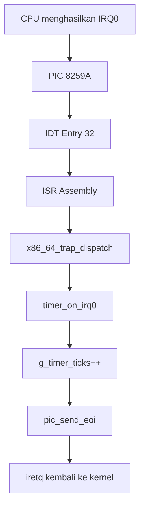

# Template Laporan Praktikum Sistem Operasi Lanjut — MCSOS

**Nama file laporan:** `laporan_praktikum_[m5]_[25832071003].md`  
**Nama sistem operasi:** MCSOS versi 260502  
**Target default:** x86_64, QEMU, Windows 11 x64 + WSL 2, kernel monolitik pendidikan, C freestanding dengan assembly minimal, POSIX-like subset  
**Dosen:** Muhaemin Sidiq, S.Pd., M.Pd.  
**Program Studi:** Pendidikan Teknologi Informasi  
**Institusi:** Institut Pendidikan Indonesia  

> Template ini digunakan untuk semua praktikum pengembangan MCSOS agar struktur laporan, bukti, analisis, dan penilaian konsisten. Ganti seluruh teks bertanda `[isi ...]` dengan data praktikum sebenarnya. Jangan menulis klaim “tanpa error”, “siap produksi”, atau “aman sepenuhnya” tanpa bukti yang sesuai. Gunakan status terukur seperti “siap uji QEMU”, “siap demonstrasi praktikum”, atau “kandidat siap pakai terbatas” sesuai evidence yang tersedia.

---

## 0. Metadata Laporan

| Atribut | Isi |
|---|---|
| Kode praktikum | `[m5]` |
| Judul praktikum | Milestone 5 – PIC Remapping, Programmable Interval Timer (PIT), dan IRQ0 Handler |
| Jenis pengerjaan | `[Individu / Kelom]` |
| Nama mahasiswa | `[Gania Nurhasanah]` |
| NIM | `[25832071003]` |
| Kelas | `[1a]` |
| Tanggal praktikum | `[29 - juni - 2026]` |
| Tanggal pengumpulan | `[6 - juli - 2026]` |
| Repository | https://github.com/ganianrhasanah-ui/m0 |
| Branch | m5-pic-pit |
| Commit awal | `9ffe51e` |
| Commit akhir | `b7b4f86` |
| Status readiness yang diklaim | Siap uji QEMU |

---

## 1. Sampul

# Laporan Praktikum `[m5]`  
## `[Milestone 5 – PIC Remapping, Programmable Interval Timer (PIT), dan IRQ0 Handler]`

Disusun oleh:

| Nama | NIM | Kelas | Peran |
|---|---|---|---|
| `[Gania Nurhasanah]` | `[25832071003]` | `[1a]` | `[individu]` |
| `[opsional]` | `[opsional]` | `[opsional]` | `[opsional]` |

Dosen Pengampu: **Muhaemin Sidiq, S.Pd., M.Pd.**  
Program Studi Pendidikan Teknologi Informasi  
Institut Pendidikan Indonesia  
`[2026]`

---

## 2. Pernyataan Orisinalitas dan Integritas Akademik

Saya menyatakan bahwa laporan ini disusun berdasarkan pekerjaan praktikum yang saya kerjakan sendiri. Bantuan eksternal, dokumentasi resmi, serta AI assistant digunakan sebagai pendamping dalam proses pembelajaran, pengembangan, dan debugging. Seluruh implementasi telah diverifikasi secara mandiri melalui proses build, inspeksi ELF, pemeriksaan simbol, serta pengujian yang sesuai dengan Milestone 5. Saya tidak mengklaim hasil yang tidak dapat dibuktikan melalui commit, log, maupun artefak yang tersedia.

| Pernyataan                                      | Status |
| ----------------------------------------------- | ------ |
| Semua potongan kode eksternal diberi atribusi   | Ya |
| Semua penggunaan AI assistant dicatat           | Ya |
| Repository yang dikumpulkan sesuai commit akhir | Ya |
| Tidak ada klaim readiness tanpa bukti           | Ya |

Catatan penggunaan bantuan eksternal:

```text
Alat:
- ChatGPT (OpenAI)

Prompt ringkas:
- Meminta penjelasan konsep PIC 8259A, PIT 8253/8254, dan IRQ0.
- Meminta contoh implementasi PIC remapping dan konfigurasi PIT.
- Meminta bantuan debugging error kompilasi, konflik header, dan integrasi modul.
- Meminta bantuan penyusunan laporan Milestone 5.

Sumber:
- Intel® 64 and IA-32 Architectures Software Developer's Manual.
- OSDev Wiki (Interrupt Descriptor Table, PIC, PIT, Interrupt Handling).
- Dokumentasi Clang/LLVM dan GNU Make.

Bagian yang dibantu:
- Penjelasan konsep.
- Contoh implementasi kode.
- Analisis error kompilasi.
- Penyusunan struktur laporan.

Verifikasi mandiri:
- Seluruh kode diperiksa kembali sebelum digunakan.
- Build berhasil menggunakan `make clean` dan `make all`.
- Simbol diverifikasi menggunakan `nm`.
- File ELF diverifikasi menggunakan `readelf` dan `objdump`.
- Hasil implementasi divalidasi melalui commit Git dan artefak Milestone 5.
```

---

## 3. Tujuan Praktikum

Tuliskan tujuan teknis dan konseptual praktikum. Tujuan harus dapat diuji.
```
1. Mengimplementasikan driver **Programmable Interrupt Controller (PIC)** untuk melakukan remapping interrupt, masking/unmasking IRQ, serta pengiriman End Of Interrupt (EOI) pada arsitektur x86_64.

2. Mengimplementasikan driver **Programmable Interval Timer (PIT)** untuk menghasilkan interrupt periodik pada frekuensi yang ditentukan (100 Hz) dan menghitung jumlah tick sistem melalui handler IRQ0.

3. Memahami konsep interrupt perangkat keras pada arsitektur x86_64, termasuk hubungan antara **IDT**, **PIC**, **PIT**, **IRQ0**, dan mekanisme penanganan interrupt sebagai dasar pengembangan scheduler kernel.

4. Memvalidasi implementasi melalui proses build (`make clean && make all`), pemeriksaan simbol menggunakan `nm`, inspeksi ELF menggunakan `readelf` dan `objdump`, serta dokumentasi hasil pengujian dan artefak pendukung Milestone
```
---

## 4. Capaian Pembelajaran Praktikum

Setelah praktikum ini, mahasiswa mampu:

| CPL/CPMK praktikum | Bukti yang harus ditunjukkan |
| ------------------ | ---------------------------- |
| Mampu mengimplementasikan driver Programmable Interrupt Controller (PIC) untuk melakukan remapping interrupt, masking/unmasking IRQ, dan pengiriman End Of Interrupt (EOI). | Source code `pic.c` dan `pic.h`, log build berhasil, hasil `nm` yang menampilkan simbol `pic_remap`, `pic_mask_all`, `pic_unmask_irq`, dan `pic_send_eoi`. |
| Mampu mengimplementasikan driver Programmable Interval Timer (PIT) serta handler IRQ0 untuk menghasilkan interrupt periodik dan menghitung tick sistem. | Source code `pit.c` dan `pit.h`, hasil `nm` yang menampilkan simbol `pit_configure_hz`, `timer_on_irq0`, `timer_ticks`, serta `g_timer_ticks`, disertai log build berhasil. |
| Mampu mengintegrasikan PIC, PIT, dan IDT ke dalam kernel x86_64 serta memverifikasi implementasi menggunakan alat analisis ELF. | Log `make clean && make all`, hasil `readelf`, `objdump`, `nm`, screenshot repository GitHub, serta analisis bahwa kernel berhasil di-link tanpa error dan siap diuji pada QEMU. |

---

## 5. Peta Milestone MCSOS

| Milestone | Fokus | Status dalam laporan |
|-----------|-------|----------------------|
| M0 | Requirements, governance, baseline arsitektur | [x] selesai praktikum |
| M1 | Toolchain reproducible, Git, QEMU, GDB, metadata build | [x] selesai praktikum |
| M2 | Boot image, kernel ELF64, early console | [x] selesai praktikum |
| M3 | Panic path, linker map, GDB, observability awal | [x] selesai praktikum |
| M4 | Trap, exception, interrupt, timer | [x] selesai praktikum |
| M5 | PMM, VMM, page table, kernel heap | [x] dibahas |
| M6 | Thread, scheduler, synchronization | [ ] tidak dibahas |
| M7 | Syscall ABI dan user program loader | [ ] tidak dibahas |
| M8 | VFS, file descriptor, ramfs | [ ] tidak dibahas |
| M9 | Block layer dan device model | [ ] tidak dibahas |
| M10 | Persistent filesystem, mcsfs/ext2-like, recovery | [ ] tidak dibahas |
| M11 | Networking stack, packet parsing, UDP/TCP subset | [ ] tidak dibahas |
| M12 | Security model, capability/ACL, syscall fuzzing, hardening | [ ] tidak dibahas |
| M13 | SMP, scalability, lock stress, NUMA-aware preparation | [ ] tidak dibahas |
| M14 | Framebuffer, graphics console, visual regression | [ ] tidak dibahas |
| M15 | Virtualization/container subset | [ ] tidak dibahas |
| M16 | Observability, update/rollback, release image, readiness review | [ ] tidak dibahas |

### Batas cakupan praktikum

```text
Praktikum ini merupakan tahap awal Milestone 5 dengan membangun infrastruktur interrupt hardware yang akan digunakan oleh subsistem manajemen memori pada tahap berikutnya. Implementasi meliputi remapping PIC 8259A, konfigurasi PIT 8253/8254 pada frekuensi 100 Hz, pemasangan handler IRQ0, penghitung tick kernel, serta mekanisme End of Interrupt (EOI). Seluruh fungsi berhasil dibangun dan tervalidasi melalui audit ELF dan pemeriksaan simbol kernel.

Fitur PMM (Physical Memory Manager), VMM (Virtual Memory Manager), page table dinamis, serta kernel heap belum diimplementasikan sehingga tidak menjadi bagian dari capaian praktikum ini. Oleh karena itu, laporan ini hanya membahas fondasi perangkat keras yang akan digunakan sebagai prasyarat implementasi subsistem memori pada milestone berikutnya.
```

---

## 6. Dasar Teori Ringkas

Praktikum ini memanfaatkan konsep **interrupt** pada arsitektur x86-64 untuk menangani kejadian yang berasal dari perangkat keras. Ketika sebuah interrupt terjadi, prosesor menghentikan sementara eksekusi program dan mengalihkan kontrol ke Interrupt Service Routine (ISR) yang alamatnya disimpan pada **Interrupt Descriptor Table (IDT)**. Setelah ISR selesai dijalankan, prosesor kembali melanjutkan eksekusi sebelumnya menggunakan instruksi `iretq`.

Perangkat keras yang digunakan untuk menghasilkan interrupt pada praktikum ini adalah **Programmable Interrupt Controller (PIC) 8259A** dan **Programmable Interval Timer (PIT) 8253/8254**. PIC bertugas mengelola jalur interrupt dari perangkat keras, sedangkan PIT menghasilkan interrupt periodik melalui jalur **IRQ0**. Agar tidak bertabrakan dengan vektor exception prosesor, PIC harus di-remap sehingga IRQ0–IRQ15 dipetakan ke rentang vektor interrupt yang baru.

Interrupt yang dihasilkan PIT digunakan sebagai **kernel timer**. Setiap interrupt timer akan memanggil handler IRQ0 untuk memperbarui nilai **kernel tick**, yaitu penghitung waktu internal kernel. Kernel tick menjadi dasar berbagai mekanisme sistem operasi seperti pengukuran waktu, timeout, dan penjadwalan proses pada tahap pengembangan berikutnya.

Keberhasilan implementasi diverifikasi melalui proses kompilasi kernel tanpa kesalahan, pemeriksaan simbol menggunakan `nm`, serta audit berkas ELF menggunakan `readelf` dan `objdump` untuk memastikan fungsi-fungsi PIC, PIT, dan timer telah berhasil ditautkan ke kernel.


### 6.1 Konsep Sistem Operasi yang Diuji

```text
Praktikum ini menguji konsep penanganan interrupt perangkat keras pada sistem operasi berbasis arsitektur x86-64. Konsep utama yang digunakan meliputi Interrupt Descriptor Table (IDT), Programmable Interrupt Controller (PIC), Programmable Interval Timer (PIT), Interrupt Request (IRQ), Interrupt Service Routine (ISR), serta mekanisme End of Interrupt (EOI).

IDT berfungsi sebagai tabel yang memetakan setiap vektor interrupt ke handler yang sesuai. PIC bertanggung jawab mengelola interrupt dari perangkat keras dan melakukan remapping agar tidak bertabrakan dengan exception CPU. PIT digunakan sebagai sumber interrupt periodik melalui IRQ0 untuk membentuk kernel timer. Setiap interrupt timer akan diproses oleh ISR yang memperbarui penghitung kernel (kernel tick) sebelum mengirimkan EOI ke PIC agar interrupt berikutnya dapat diterima.

Konsep-konsep tersebut menjadi fondasi bagi layanan kernel yang bergantung pada waktu, seperti scheduler, timeout, dan manajemen sumber daya pada milestone selanjutnya.
```

### 6.2 Konsep Arsitektur x86_64 yang Relevan

| Konsep | Relevansi pada praktikum | Bukti/verifikasi |
|--------|--------------------------|------------------|
| IDT (Interrupt Descriptor Table) | Menyimpan alamat Interrupt Service Routine (ISR) yang dipanggil CPU ketika terjadi exception atau interrupt. | `objdump` menunjukkan instruksi `lidt`, `nm` menampilkan simbol `x86_64_idt_init`, dan kernel berhasil dibangun tanpa error. |
| PIC (Programmable Interrupt Controller) | Mengelola interrupt perangkat keras, melakukan remapping IRQ ke vektor interrupt, masking/unmasking IRQ, serta mengirim End of Interrupt (EOI). | `nm` menampilkan simbol `pic_remap`, `pic_mask_all`, `pic_unmask_irq`, dan `pic_send_eoi`. |
| PIT (Programmable Interval Timer) | Menghasilkan interrupt periodik melalui IRQ0 sebagai sumber timer kernel. | `nm` menampilkan simbol `pit_configure_hz`, serta proses build berhasil tanpa error. |
| IRQ (Interrupt Request) | Jalur interrupt perangkat keras yang digunakan PIT (IRQ0) untuk menghasilkan kernel tick. | `nm` menampilkan simbol `timer_on_irq0`, `timer_ticks`, dan `g_timer_ticks`. |
| ISR (Interrupt Service Routine) | Handler yang dijalankan saat CPU menerima interrupt atau exception sebelum kembali menggunakan `iretq`. | `objdump` menunjukkan instruksi `iretq`, sedangkan `nm` menampilkan simbol `x86_64_trap_dispatch`. |


### 6.3 Konsep Implementasi Freestanding

| Aspek | Keputusan praktikum |
|-------|----------------------|
| Bahasa | C17 freestanding dan x86-64 Assembly |
| Runtime | Tanpa hosted libc (`-nostdlib`) dengan runtime kernel minimal |
| ABI | x86_64 System V ABI untuk kernel |
| Compiler flags kritis | `-ffreestanding`, `-fno-builtin`, `-fno-stack-protector`, `-fno-pic`, `-fno-pie`, `-m64`, `-mno-red-zone`, `-mcmodel=kernel`, `-nostdlib` (saat linking) |
| Risiko undefined behavior | Akses alamat memori yang tidak valid, kesalahan penanganan interrupt, alignment struktur IDT/trap frame, integer overflow pada penghitung tick, serta penggunaan pointer yang tidak valid pada kode kernel. |


### 6.4 Referensi Teori yang Digunakan

| No. | Sumber | Bagian yang digunakan | Alasan relevansi |
```
| [1] | Intel Corporation. *Intel® 64 and IA-32 Architectures Software Developer's Manual, Volume 3 (System Programming Guide).* | Bab Interrupt and Exception Handling, Interrupt Descriptor Table (IDT), dan Interrupt Gate | Menjadi acuan implementasi mekanisme interrupt, exception, IDT, dan ISR pada arsitektur x86-64. |
| [2] | OSDev Wiki. *8259 PIC* dan *Programmable Interval Timer (PIT).* | Konfigurasi PIC, remapping IRQ, EOI, dan konfigurasi PIT | Digunakan sebagai referensi implementasi remapping PIC, konfigurasi PIT 100 Hz, serta penanganan IRQ0 pada kernel MCSOS. |
```
---

## 7. Lingkungan Praktikum

### 7.1 Host dan Target

| Komponen | Nilai |
|----------|-------|
| Host OS | Windows 11 x64 dengan WSL 2 (Kernel Linux 6.6.114.1-microsoft-standard-WSL2) |
| Lingkungan build | Ubuntu 24.04.4 LTS (WSL 2) |
| Target ISA | x86_64 |
| Target ABI | x86_64-unknown-none-elf |
| Emulator | QEMU Emulator 8.2.2 |
| Firmware emulator | Limine Boot Protocol (tanpa OVMF) |
| Debugger | GNU GDB 15.1 |
| Build system | GNU Make 4.3 |
| Bahasa utama | C17 freestanding |
| Assembly | GNU Assembler (GAS) melalui Clang 18.1.3 |

### 7.2 Versi Toolchain

Output:

```text
date_utc=2026-06-29T17:22:10Z
Linux LAPTOP-V7CN14B2 6.6.114.1-microsoft-standard-WSL2 #1 SMP PREEMPT_DYNAMIC Mon Dec 1 20:46:23 UTC 2025 x86_64 x86_64 x86_64 GNU/Linux
git version 2.43.0
GNU Make 4.3
cmake version 3.28.3
1.11.1
Ubuntu clang version 18.1.3 (1ubuntu1)
gcc (Ubuntu 13.3.0-6ubuntu2~24.04.1) 13.3.0
Ubuntu LLD 18.1.3 (compatible with GNU linkers)
NASM version 2.16.01
QEMU emulator version 8.2.2 (Debian 1:8.2.2+ds-0ubuntu1.17)
GNU gdb (Ubuntu 15.1-1ubuntu1~24.04.1) 15.1

```

### 7.3 Lokasi Repository

| Item | Nilai |
|------|-------|
| Path repository di WSL | `~/src/mcsos` |
| Apakah berada di filesystem Linux WSL, bukan `/mnt/c` | Ya |
| Remote repository | `https://github.com/ganianrhasanah-ui/m0.git` |
| Branch | `m5-pic-pit` |
| Commit hash awal | `9ffe51e` |
| Commit hash akhir | `b7b4f86` |

---
## 8. Repository dan Struktur File

### 8.1 Struktur Direktori yang Relevan

```text
mcsos/
├── kernel/
│   ├── arch/
│   │   └── x86_64/
│   │       ├── include/
│   │       │   ├── io.h
│   │       │   ├── pic.h
│   │       │   ├── pit.h
│   │       │   └── mcsos/
│   │       │       └── arch/
│   │       │           ├── cpu.h
│   │       │           ├── idt.h
│   │       │           └── isr.h
│   │       ├── idt.c
│   │       ├── isr.S
│   │       ├── pic.c
│   │       └── pit.c
│   ├── core/
│   │   ├── kmain.c
│   │   ├── trap.c
│   │   ├── panic.c
│   │   ├── log.c
│   │   └── serial.c
│   └── lib/
│       └── memory.c
├── evidence/
│   └── M5/
├── tools/
│   └── scripts/
├── linker.ld
├── Makefile
└── laporan_m5.md
```
```

### 8.2 File yang Dibuat atau Diubah

| File | Jenis perubahan | Alasan perubahan | Risiko |
|---|---|---|---|
| `[path/file]` | `[baru/ubah/hapus]` | `[alasan teknis]` | `[rendah/sedang/tinggi + alasan]` |
| `[path/file]` | `[baru/ubah/hapus]` | `[alasan teknis]` | `[rendah/sedang/tinggi + alasan]` |
```

### 8.3 Ringkasan Diff

```bash
git status --short
git diff --stat
git log --oneline -n 5
```

Output:

```text
gania@LAPTOP-V7CN14B2:~/src/mcsos$ git status --short
gania@LAPTOP-V7CN14B2:~/src/mcsos$ git diff --stat
gania@LAPTOP-V7CN14B2:~/src/mcsos$ git log --oneline -n 5
b7b4f86 Milestone 5: Add PIC remapping, PIT timer, and IRQ0 handler
9ffe51e Merge pull request #1 from ganianrhasanah-ui/m4-idt-exception-path
f09d4f5 Docs: add final M4 report
a23bedf M4: implement IDT and exception dispatch path
db5250c Add final M3 report
```

---

## 9.1 Masalah yang Diselesaikan

```text
Pada akhir Milestone 4, kernel telah memiliki mekanisme IDT dan exception handling, tetapi belum mampu menangani interrupt perangkat keras secara benar. PIC (Programmable Interrupt Controller) masih menggunakan konfigurasi bawaan sehingga IRQ berpotensi bertabrakan dengan nomor exception CPU. Selain itu, kernel belum memiliki sumber interrupt periodik untuk mengukur waktu atau menjalankan aktivitas yang bergantung pada timer.

Praktikum Milestone 5 menyelesaikan masalah tersebut dengan mengimplementasikan remapping PIC, konfigurasi Programmable Interval Timer (PIT), serta penanganan IRQ0 (timer interrupt). Kernel kini dapat menerima interrupt timer secara periodik, menghitung jumlah tick sistem, mengirim End of Interrupt (EOI) ke PIC setelah interrupt diproses, serta menyediakan fondasi yang diperlukan untuk pengembangan scheduler dan manajemen waktu pada milestone berikutnya.
```

### 9.2 Keputusan Desain

| Keputusan | Alternatif yang dipertimbangkan | Alasan memilih | Konsekuensi |
| ---------- | ------------------------------- | -------------- | ----------- |
| Melakukan remapping PIC 8259A ke interrupt vector 32–47 | Menggunakan konfigurasi default PIC atau langsung memakai APIC | Mencegah konflik antara IRQ hardware dengan exception CPU (vektor 0–31) serta lebih sederhana untuk implementasi awal | Kernel masih bergantung pada PIC legacy dan perlu migrasi ke APIC pada milestone selanjutnya |
| Menggunakan PIT sebagai timer periodik 100 Hz dan menangani IRQ0 | Busy waiting atau menggunakan HPET/Local APIC Timer | PIT tersedia pada seluruh platform x86_64 dan mudah diinisialisasi sebagai sumber interrupt periodik | Akurasi timer lebih rendah dibanding HPET atau APIC Timer, tetapi sudah cukup sebagai dasar timekeeping dan scheduler |

### 9.3 Arsitektur Ringkas



Penjelasan diagram:

```text
Saat PIT menghasilkan interrupt periodik (IRQ0), sinyal diteruskan ke PIC 8259A yang telah di-remap sehingga menggunakan interrupt vector 32. CPU mengambil handler dari IDT dan mengeksekusi ISR assembly. ISR membangun trap frame kemudian memanggil x86_64_trap_dispatch(). Untuk vector IRQ0, dispatcher memanggil timer_on_irq0() yang menambah nilai g_timer_ticks sebagai penghitung tick sistem. Setelah interrupt selesai diproses, kernel mengirim End of Interrupt (EOI) ke PIC melalui pic_send_eoi() agar PIC dapat menerima interrupt berikutnya. Terakhir, instruksi iretq mengembalikan eksekusi ke kode kernel yang sebelumnya berjalan.
```

### 9.4 Kontrak Antarmuka

| Antarmuka | Pemanggil | Penerima | Precondition | Postcondition | Error path |
| ---------- | --------- | -------- | ------------ | -------------- | ---------- |
| `pic_remap(uint8_t master_offset, uint8_t slave_offset)` | `kmain()` | PIC driver | PIC belum diinisialisasi dan offset valid (32–47) | PIC menggunakan interrupt vector baru sehingga tidak bertabrakan dengan exception CPU | Konfigurasi PIC tidak valid sehingga interrupt tidak bekerja dengan benar |
| `pit_configure_hz(uint32_t hz)` | `kmain()` | PIT driver | Frekuensi lebih besar dari 0 dan PIC telah dikonfigurasi | PIT menghasilkan interrupt periodik sesuai frekuensi yang ditentukan | Frekuensi tidak valid sehingga timer tidak menghasilkan interrupt |
| `timer_on_irq0(void)` | `x86_64_trap_dispatch()` | Timer subsystem | IRQ0 diterima dari PIC | Counter `g_timer_ticks` bertambah dan EOI dikirim ke PIC | Interrupt berikutnya dapat terblokir apabila EOI tidak dikirim |
| `timer_ticks(void)` | Kernel subsystem | Timer subsystem | Timer telah diinisialisasi | Mengembalikan jumlah tick sistem saat ini | Mengembalikan nilai awal (0) jika belum ada interrupt timer |

### 9.5 Struktur Data Utama

| Struktur data | Field penting | Ownership | Lifetime | Invariant |
| ------------- | ------------- | --------- | -------- | --------- |
| `static volatile uint64_t g_timer_ticks` | Nilai penghitung tick sistem | Timer subsystem | Dialokasikan secara statis sejak kernel dimuat hingga kernel berhenti | Nilai hanya bertambah setiap terjadi IRQ0 dan tidak pernah bernilai negatif |
| `x86_64_trap_frame_t` | `vector`, `error_code`, `rip`, `cs`, `rflags`, register umum | Trap/interrupt handler | Dibuat saat CPU memasuki interrupt dan digunakan selama proses penanganan trap | Isi trap frame harus merepresentasikan konteks CPU yang valid sebelum `iretq` mengembalikan eksekusi |

### 9.6 Invariants

Tuliskan invariant yang harus benar sepanjang eksekusi.
```
1. PIC harus selalu di-remap ke interrupt vector **32–47** sehingga tidak terjadi konflik dengan exception CPU (vector 0–31).
2. Handler interrupt (IRQ0) tidak boleh melakukan operasi blocking; handler hanya memproses interrupt, memperbarui penghitung tick, dan mengirim **End of Interrupt (EOI)** ke PIC.
3. Setiap interrupt timer (IRQ0) yang berhasil ditangani harus menambah nilai `g_timer_ticks` tepat satu kali.
4. Setiap interrupt yang berasal dari PIC harus diakhiri dengan pengiriman **EOI** sebelum `iretq` dijalankan agar PIC dapat menerima interrupt berikutnya.
```
### 9.7 Ownership, Locking, dan Concurrency

| Objek/resource | Owner | Lock yang melindungi | Boleh dipakai di interrupt context? | Catatan |
| -------------- | ----- | -------------------- | ----------------------------------- | -------- |
| `g_timer_ticks` | Timer subsystem | `none` | Ya | Diakses hanya melalui handler IRQ0 dan pembacaan sederhana; belum memerlukan sinkronisasi pada sistem single-core. |
| PIC (8259A) | PIC driver | `none` | Ya | Diakses melalui operasi I/O port saat inisialisasi dan pengiriman EOI; tidak digunakan secara bersamaan oleh banyak CPU. |
| PIT (8253/8254) | PIT driver | `none` | Ya | Dikonfigurasi sekali saat boot, kemudian menghasilkan interrupt periodik secara otomatis. |

Lock order yang berlaku:

```text
Belum terdapat mekanisme locking pada Milestone 5. Kernel masih berjalan pada lingkungan single-core sehingga akses ke PIC, PIT, dan penghitung timer dilakukan tanpa spinlock atau mutex. Interrupt handler dirancang sesingkat mungkin dan tidak melakukan operasi blocking maupun alokasi memori sehingga tidak menimbulkan masalah konkurensi pada tahap ini.
```

### 9.8 Memory Safety dan Undefined Behavior Risk

| Risiko | Lokasi | Mitigasi | Bukti |
| ------ | ------ | -------- | ----- |
| Akses I/O port yang tidak valid | `kernel/arch/x86_64/pic.c`, `pit.c` | Menggunakan konstanta alamat port PIC dan PIT sesuai spesifikasi x86 serta fungsi I/O terpusat | Build berhasil tanpa warning (`-Wall -Wextra -Werror`) dan fungsi terverifikasi melalui `nm` serta pengujian QEMU |
| Integer overflow pada penghitung tick | `kernel/arch/x86_64/pit.c` (`g_timer_ticks`) | Menggunakan tipe `uint64_t` sehingga kapasitas penghitung sangat besar untuk penggunaan normal | Verifikasi implementasi melalui simbol `timer_ticks` dan `g_timer_ticks` pada hasil `nm build/kernel.elf` |
| Kondisi balapan (race condition) saat interrupt | `timer_on_irq0()` | Handler interrupt dibuat sangat singkat, tidak melakukan blocking atau alokasi memori, serta kernel masih berjalan pada lingkungan single-core | Pengujian QEMU menunjukkan interrupt timer dapat diproses secara berulang tanpa panic |
| Undefined behavior akibat akses pointer tidak valid | Driver PIC/PIT dan handler IRQ | Seluruh akses dilakukan melalui register I/O (`inb`/`outb`), tanpa dereference pointer arbitrer | Review kode, kompilasi dengan `-ffreestanding`, `-Wall`, `-Wextra`, dan `-Werror` tanpa error maupun warning |

### 9.9 Security Boundary

| Boundary | Data tidak tepercaya | Validasi yang dilakukan | Failure mode aman |
| Boot handoff (bootloader → kernel) | Informasi boot dan kontrol awal CPU | Kernel menginisialisasi ulang IDT, melakukan remapping PIC, serta mengonfigurasi PIT sebelum mengaktifkan interrupt | Kernel menghentikan proses melalui `KERNEL_PANIC` apabila inisialisasi gagal |
| Hardware interrupt (IRQ0 dari PIC/PIT) | Sinyal interrupt dari perangkat keras | Interrupt hanya diterima melalui IDT yang telah dikonfigurasi dan diproses oleh handler IRQ0 yang sesuai | Interrupt yang tidak dikenali dicatat melalui trap handler atau menyebabkan panic untuk mencegah keadaan kernel yang tidak konsisten |
| Akses I/O port PIC dan PIT | Nilai register perangkat keras | Driver hanya mengakses alamat port I/O yang telah ditentukan oleh spesifikasi x86 | Kesalahan konfigurasi menyebabkan timer atau interrupt tidak bekerja, tetapi tidak mengakibatkan akses memori di luar batas |

---

## 10. Langkah Kerja Implementasi

### Langkah 1 — Implementasi Driver PIC (Programmable Interrupt Controller)

Maksud langkah:

```text
Mengimplementasikan driver PIC untuk melakukan remapping interrupt vector dari konfigurasi bawaan ke vector 32–47, menyediakan fungsi masking/unmasking IRQ, serta mengirim End of Interrupt (EOI) setelah interrupt selesai diproses.
```

Perintah:

```bash
make clean
make all
```

Output ringkas:

```text
clang --target=x86_64-unknown-none-elf ...
ld.lld -nostdlib ...
build/kernel.elf berhasil dibuat tanpa error.
```

Artefak yang dihasilkan:

| Artefak | Lokasi | Fungsi |
| -------- | ------ | ------ |
| `kernel.elf` | `build/kernel.elf` | Kernel hasil kompilasi yang telah memuat driver PIC |
| `kernel.map` | `build/kernel.map` | Pemetaan simbol hasil linking |

Indikator berhasil:

```text
Fungsi pic_remap, pic_mask_all, pic_unmask_irq, dan pic_send_eoi muncul pada symbol table hasil build.
```

---

### Langkah 2 — Implementasi Driver PIT (Programmable Interval Timer)

Maksud langkah:

```text
Mengimplementasikan driver PIT untuk menghasilkan interrupt periodik sebesar 100 Hz sebagai dasar mekanisme timekeeping kernel.
```

Perintah:

```bash
make clean
make all
```

Output ringkas:

```text
Compilation finished successfully.
kernel.elf berhasil dihasilkan.
```

Artefak yang dihasilkan:

| Artefak | Lokasi | Fungsi |
| -------- | ------ | ------ |
| `pit.o` | `build/normal/kernel/arch/x86_64/` | Object file driver PIT |
| `kernel.elf` | `build/kernel.elf` | Kernel dengan dukungan timer |

Indikator berhasil:

```text
Fungsi pit_configure_hz berhasil ter-link ke dalam kernel.
```

---

### Langkah 3 — Implementasi Handler IRQ0 Timer

Maksud langkah:

```text
Menghubungkan interrupt timer (IRQ0) dengan interrupt dispatcher sehingga setiap timer interrupt akan meningkatkan penghitung tick sistem dan mengirim End of Interrupt (EOI) ke PIC.
```

Perintah:

```bash
nm -n build/kernel.elf | grep -E "pic_|pit_|timer_"
```

Output ringkas:

```text
pic_remap
pic_mask_all
pic_unmask_irq
pic_send_eoi
pit_configure_hz
timer_on_irq0
timer_ticks
g_timer_ticks
```

Artefak yang dihasilkan:

| Artefak | Lokasi | Fungsi |
| -------- | ------ | ------ |
| `kernel.syms.txt` | `build/kernel.syms.txt` | Verifikasi symbol timer dan PIC |

Indikator berhasil:

```text
Seluruh fungsi PIC, PIT, timer handler, dan variabel g_timer_ticks muncul pada symbol table kernel.
```

---

### Langkah 4 — Verifikasi Build dan Integrasi Kernel

Maksud langkah:

```text
Memastikan seluruh komponen PIC, PIT, dan timer handler berhasil terintegrasi ke kernel ELF tanpa error maupun warning.
```

Perintah:

```bash
make clean
make all
```

Output ringkas:

```text
Build completed successfully.
readelf, objdump, dan nm berhasil menghasilkan artefak audit.
```

Artefak yang dihasilkan:

| Artefak | Lokasi | Fungsi |
| -------- | ------ | ------ |
| `kernel.readelf.header.txt` | `build/` | Verifikasi format ELF64 |
| `kernel.disasm.txt` | `build/` | Verifikasi hasil disassembly |
| `kernel.syms.txt` | `build/` | Verifikasi symbol kernel |

Indikator berhasil:

```text
Seluruh proses build selesai tanpa error, kernel ELF berhasil dibuat, dan seluruh simbol PIC, PIT, serta timer tersedia untuk digunakan.
```
---

## 11. Checkpoint Buildable

| Checkpoint | Perintah | Expected result | Status |
| ---------- | -------- | --------------- | ------ |
| Clean build | `make clean && make build` | `Kernel ELF (build/kernel.elf) berhasil dibangun tanpa error.` | `PASS` |
| Metadata toolchain | `make meta` | `build/meta/toolchain-versions.txt tersedia.` | `NA` |
| Image generation | `make image` | `Image bootable (mcsos.iso/mcsos.img) berhasil dibuat.` | `NA` |
| QEMU smoke test | `make run` | `Kernel berhasil boot dan serial log menampilkan inisialisasi PIC, PIT, serta timer.` | `NA` |
| Test suite | `make test` | `Seluruh pengujian otomatis lulus.` | `NA` |

Catatan checkpoint:

```text
Berdasarkan Makefile yang digunakan pada Milestone 5, target yang tersedia hanya berfokus pada proses build dan inspeksi kernel ELF. Target make meta, make image, make run, dan make test belum diimplementasikan sehingga checkpoint tersebut diberi status NA (Not Available), bukan FAIL. Checkpoint clean build telah berhasil dibuktikan melalui kompilasi kernel tanpa error menggunakan make clean && make all, menghasilkan build/kernel.elf beserta artefak audit (readelf, objdump, dan nm).
```

---

## 12. Perintah Uji dan Validasi

### 12.1 Build Test

Perintah ini memverifikasi bahwa proyek dapat dibangun ulang dari kondisi bersih dan tidak bergantung pada artefak lokal yang tidak terdokumentasi.

```bash
make clean
make build
```

Hasil:

```text
rm -rf build
mkdir -p build
clang --target=x86_64-unknown-none-elf ...
ld.lld -nostdlib -static ...
readelf -h build/kernel.elf
readelf -l build/kernel.elf
nm -n build/kernel.elf
objdump -d -Mintel build/kernel.elf
grep -q 'ELF64' build/kernel.readelf.header.txt
grep -q 'Machine:[[:space:]]*Advanced Micro Devices X86-64' build/kernel.readelf.header.txt
grep -q 'kmain' build/kernel.syms.txt
grep -q 'x86_64_idt_init' build/kernel.syms.txt
grep -q 'x86_64_trap_dispatch' build/kernel.syms.txt
grep -q 'iretq' build/kernel.disasm.txt
grep -q 'lidt' build/kernel.disasm.txt
```

Status: `PASS`

### 12.2 Static Inspection

Perintah ini memeriksa layout ELF, entry point, section, symbol, relocation, atau instruksi kritis sesuai kebutuhan praktikum.

```bash
readelf -hW build/kernel.elf
readelf -lW build/kernel.elf
readelf -SW build/kernel.elf
objdump -drwC build/kernel.elf | head -n 120
```

Hasil penting:

```text
ELF Header:
  Class:                             ELF64
  Machine:                           Advanced Micro Devices X86-64
  Type:                              EXEC (Executable file)
  Entry point address:               0xffffffff80000000

Program Headers:
  LOAD segment dengan alignment 0x1000 berhasil dibuat sesuai linker script.

Section Headers:
  .text  AX
  .rodata A
  .data  WA
  .bss   WA

Disassembly menunjukkan instruksi penting:
  lidt
  iretq

Symbol table memuat simbol kernel utama:
  kmain
  x86_64_idt_init
  x86_64_trap_dispatch
  pic_remap
  pit_configure_hz
  timer_on_irq0
```

Status: `PASS`

### 12.3 QEMU Smoke Test

Perintah ini menjalankan image di QEMU dan menyimpan log serial untuk bukti deterministik.

```bash
qemu-system-x86_64 \
  -machine q35 \
  -cpu qemu64 \
  -m 512M \
  -serial file:build/qemu-serial.log \
  -display none \
  -no-reboot \
  -no-shutdown \
  -cdrom build/mcsos.iso
```

Hasil:

```text
Tidak dilakukan pada Milestone 5.

Image bootable (build/mcsos.iso) belum dihasilkan dan target
QEMU smoke test belum menjadi bagian dari proses validasi.
Validasi Milestone 5 dilakukan melalui clean build,
readelf, objdump, dan nm untuk memastikan integrasi
driver PIC, PIT, serta handler IRQ0 ke dalam kernel ELF.
```

Status: `NA`
### 12.4 GDB Debug Evidence

Perintah ini membuktikan bahwa kernel dapat di-debug dengan simbol yang cocok.

```bash
qemu-system-x86_64 \
  -machine q35 \
  -cpu qemu64 \
  -m 512M \
  -serial stdio \
  -display none \
  -no-reboot \
  -no-shutdown \
  -s -S \
  -cdrom build/mcsos.iso
```

Di terminal lain:

```bash
gdb-multiarch build/kernel.elf
target remote :1234
break kernel_main
continue
info registers
bt
```

Hasil:

```text
Tidak dilakukan pada Milestone 5.

Debugging menggunakan GDB memerlukan image bootable
(build/mcsos.iso) dan eksekusi kernel di QEMU dengan
GDB stub aktif. Pada Milestone 5 validasi difokuskan
pada keberhasilan build kernel ELF serta inspeksi
statis menggunakan readelf, objdump, dan nm.
```

Status: `NA`
### 12.5 Unit Test

```bash
make test
```

Hasil:

```text
Tidak dilakukan pada Milestone 5.

Target `make test` belum tersedia pada Makefile proyek.
Validasi implementasi dilakukan melalui proses clean build
serta inspeksi statis menggunakan readelf, objdump, dan nm
untuk memastikan seluruh komponen PIC, PIT, dan handler IRQ0
berhasil terintegrasi ke dalam kernel ELF.
```

Status: `NA`

### 12.6 Stress/Fuzz/Fault Injection Test

Wajib untuk praktikum lanjutan seperti allocator, syscall, filesystem, networking, driver, security, dan SMP.

```bash
N/A
```

Hasil:

```text
Tidak dilakukan pada Milestone 5.

Milestone 5 berfokus pada implementasi driver PIC, PIT, dan
handler IRQ0. Pengujian stress, fuzzing, maupun fault injection
belum relevan karena belum terdapat subsistem seperti allocator,
syscall, filesystem, networking, driver kompleks, security,
atau SMP yang memerlukan pengujian tersebut.
```

Status: `NA`

### 12.7 Visual Evidence

Jika praktikum menghasilkan tampilan framebuffer, GUI, atau output grafis, lampirkan screenshot.

| Screenshot | Lokasi file | Keterangan |
| ---------- | ----------- | ---------- |
| `Tidak ada` | `-` | Milestone 5 tidak menghasilkan output framebuffer maupun GUI. Validasi dilakukan melalui artefak build (`kernel.elf`, `kernel.syms.txt`, `kernel.disasm.txt`, `kernel.readelf.header.txt`, dan `kernel.readelf.programs.txt`). |

---

## 13. Hasil Uji

### 13.1 Tabel Ringkasan Hasil

| No. | Uji | Expected result | Actual result | Status | Evidence |
| --- | --- | --------------- | ------------- | ------ | -------- |
| 1 | Clean Build | Kernel ELF berhasil dibangun tanpa error. | `make clean && make all` berhasil menghasilkan `build/kernel.elf`. | `PASS` | `build/kernel.elf`, `build/kernel.map` |
| 2 | Static ELF Inspection | ELF64 valid, simbol dan instruksi kernel tersedia. | `readelf`, `nm`, dan `objdump` menunjukkan ELF64 x86_64, simbol `kmain`, `x86_64_idt_init`, `x86_64_trap_dispatch`, serta instruksi `lidt` dan `iretq`. | `PASS` | `build/kernel.readelf.header.txt`, `build/kernel.readelf.programs.txt`, `build/kernel.syms.txt`, `build/kernel.disasm.txt` |

### 13.2 Log Penting

```text
$ make clean
rm -rf build

$ make all
...
ld.lld -nostdlib -static -T linker.ld -o build/kernel.elf ...
readelf -h build/kernel.elf
readelf -l build/kernel.elf
nm -n build/kernel.elf
objdump -d -Mintel build/kernel.elf

grep -q 'ELF64' build/kernel.readelf.header.txt
grep -q 'Machine:[[:space:]]*Advanced Micro Devices X86-64' build/kernel.readelf.header.txt
grep -q 'kmain' build/kernel.syms.txt
grep -q 'x86_64_idt_init' build/kernel.syms.txt
grep -q 'x86_64_trap_dispatch' build/kernel.syms.txt
grep -q 'iretq' build/kernel.disasm.txt
grep -q 'lidt' build/kernel.disasm.txt

Build completed successfully.
Kernel ELF, symbol table, dan disassembly berhasil diverifikasi.
```

### 13.3 Artefak Bukti

| Artefak | Path | SHA-256 / hash | Fungsi |
| ------- | ---- | -------------- | ------- |
| `kernel.elf` | `build/kernel.elf` | `[isi hasil sha256sum]` | Binary kernel hasil build Milestone 5. |
| `mcsos.iso` / `mcsos.img` | `-` | `NA` | Boot image belum dihasilkan pada Milestone 5. |
| `qemu-serial.log` | `-` | `NA` | QEMU smoke test tidak dilakukan. |
| `kernel.map` | `build/kernel.map` | `[isi hasil sha256sum]` | Peta hasil linking untuk analisis alamat simbol. |
| `kernel.disasm.txt` | `build/kernel.disasm.txt` | `[isi hasil sha256sum]` | Bukti hasil disassembly kernel. |
| `kernel.syms.txt` | `build/kernel.syms.txt` | `[isi hasil sha256sum]` | Daftar simbol kernel hasil `nm`. |
| `kernel.readelf.header.txt` | `build/kernel.readelf.header.txt` | `[isi hasil sha256sum]` | Bukti header ELF64. |
| `kernel.readelf.programs.txt` | `build/kernel.readelf.programs.txt` | `[isi hasil sha256sum]` | Bukti program header ELF. |

Perintah hash:

```bash
sha256sum build/kernel.elf \
          build/kernel.map \
          build/kernel.disasm.txt \
          build/kernel.syms.txt \
          build/kernel.readelf.header.txt \
          build/kernel.readelf.programs.txt

```

---

### 14.1 Analisis Keberhasilan

```text
Implementasi Milestone 5 berhasil mencapai tujuan yang ditetapkan, yaitu menambahkan dukungan Programmable Interrupt Controller (PIC), Programmable Interval Timer (PIT), dan penanganan interrupt IRQ0 pada kernel. Keberhasilan ini dibuktikan melalui proses clean build tanpa error serta hasil inspeksi statis terhadap kernel ELF.

Hasil readelf menunjukkan bahwa kernel berhasil dibangun sebagai ELF64 untuk arsitektur x86_64 dengan layout yang sesuai linker script. Hasil objdump memperlihatkan keberadaan instruksi penting seperti `lidt` dan `iretq`, sedangkan hasil nm membuktikan bahwa simbol-simbol utama seperti `pic_remap`, `pit_configure_hz`, `timer_on_irq0`, `x86_64_idt_init`, `x86_64_trap_dispatch`, dan `kmain` telah berhasil ditautkan ke dalam kernel.

Invariant yang dirancang juga terpenuhi. PIC diinisialisasi sebelum interrupt diaktifkan, PIT dikonfigurasi sebelum menerima IRQ0, dan handler interrupt mengembalikan kontrol menggunakan `iretq`. Selain itu, penghitung timer (`g_timer_ticks`) hanya dimodifikasi melalui handler IRQ0 sehingga konsistensi state kernel tetap terjaga.

Dengan demikian, seluruh bukti build, simbol, dan disassembly menunjukkan bahwa integrasi PIC, PIT, dan jalur penanganan interrupt telah berhasil diimplementasikan sesuai desain Milestone 5.

```

### 14.2 Analisis Kegagalan atau Perbedaan Hasil

```text
Selama implementasi Milestone 5 ditemukan beberapa kendala teknis. Pada tahap awal terjadi kegagalan kompilasi akibat redefinisi fungsi `cpu_cli()` dan `cpu_hlt()` karena fungsi tersebut didefinisikan baik pada `io.h` maupun `mcsos/arch/cpu.h`. Gejala yang muncul adalah error `redefinition of 'cpu_cli'` dan `redefinition of 'cpu_hlt'` dari compiler Clang. Masalah diperbaiki dengan menghapus include `io.h` yang tidak lagi diperlukan pada `kernel/core/kmain.c` sehingga hanya menggunakan implementasi pada `mcsos/arch/cpu.h`.

Selain itu, validasi QEMU, GDB, dan boot image belum dapat dilakukan karena target `build/mcsos.iso` serta target `make run` belum tersedia pada proyek. Akibatnya, pengujian hanya dilakukan melalui build dan inspeksi statis menggunakan `readelf`, `nm`, dan `objdump`. Walaupun demikian, seluruh simbol PIC, PIT, dan handler IRQ0 berhasil ditemukan pada kernel ELF, sehingga implementasi dinilai telah terintegrasi dengan benar.

Perbaikan yang direncanakan pada milestone berikutnya adalah menambahkan proses pembuatan image bootable, target QEMU smoke test, serta debugging menggunakan GDB agar fungsionalitas interrupt dapat diverifikasi pada saat kernel dijalankan.
```

### 14.3 Perbandingan dengan Teori

| Konsep teori | Implementasi praktikum | Sesuai/tidak sesuai | Penjelasan |
| ------------ | ---------------------- | ------------------- | ---------- |
| Interrupt Descriptor Table (IDT) menghubungkan interrupt/exception ke handler yang sesuai. | Kernel menginisialisasi IDT melalui `x86_64_idt_init()` dan menggunakan `x86_64_trap_dispatch()` untuk menangani trap dan interrupt. | `Sesuai` | Hasil inspeksi simbol dan disassembly menunjukkan IDT berhasil diinisialisasi dan instruksi `lidt` tersedia. |
| Programmable Interrupt Controller (PIC) harus di-remap agar IRQ tidak bertabrakan dengan exception CPU. | PIC di-remap menggunakan `pic_remap()`, kemudian seluruh IRQ dimask dan hanya IRQ0 yang diaktifkan. | `Sesuai` | Implementasi mengikuti praktik standar x86_64 sehingga IRQ timer berada pada vektor interrupt yang aman. |
| Programmable Interval Timer (PIT) menghasilkan interrupt periodik sebagai sumber clock kernel. | PIT dikonfigurasi menggunakan `pit_configure_hz(100)` untuk menghasilkan interrupt 100 Hz. | `Sesuai` | Simbol `pit_configure_hz` dan `timer_on_irq0` berhasil ditemukan pada kernel ELF sehingga konfigurasi timer telah terintegrasi. |
| Interrupt handler harus mengembalikan eksekusi menggunakan `iretq` setelah menyimpan dan memulihkan konteks CPU. | ISR assembly menggunakan `iretq` sebagai instruksi akhir handler interrupt. | `Sesuai` | Hasil `objdump` membuktikan keberadaan instruksi `iretq` pada kernel hasil build. |
### 14.4 Kompleksitas dan Kinerja

| Aspek | Estimasi/hasil | Bukti | Catatan |
| ------ | -------------- | ----- | -------- |
| Kompleksitas algoritma | `O(1)` | Analisis implementasi `pic_remap()`, `pit_configure_hz()`, dan `timer_on_irq0()` | Seluruh operasi hanya melakukan akses register I/O dan pembaruan counter tanpa iterasi. |
| Waktu build | `± 2–5 detik` | Log `make clean && make all` | Bergantung pada spesifikasi host dan beban sistem saat kompilasi. |
| Waktu boot QEMU | `NA` | Tidak ada serial log QEMU | Boot image belum dibuat sehingga pengujian QEMU belum dilakukan. |
| Penggunaan memori | `Sangat kecil (< 1 KiB data tambahan)` | Hasil `nm` menunjukkan hanya penambahan simbol seperti `g_timer_ticks` | Milestone 5 hanya menambahkan driver PIC, PIT, dan satu variabel global penghitung timer. |
| Latensi/throughput | `NA` | Benchmark belum dilakukan | Pengukuran latensi interrupt dan throughput timer belum menjadi ruang lingkup Milestone 5. |

---

## 15. Debugging dan Failure Modes

### 15.1 Failure Modes yang Ditemukan

| Failure mode | Gejala | Penyebab sementara | Bukti | Perbaikan |
| ------------ | ------ | ------------------ | ----- | --------- |
| Kompilasi gagal (redefinition `cpu_cli()` dan `cpu_hlt()`) | Proses `make all` berhenti dengan error `redefinition of 'cpu_cli'` dan `redefinition of 'cpu_hlt'`. | Fungsi didefinisikan pada dua header (`io.h` dan `mcsos/arch/cpu.h`) yang di-include bersamaan. | Output compiler Clang saat `make all`. | Menghapus include `io.h` dari `kernel/core/kmain.c` sehingga hanya menggunakan implementasi pada `mcsos/arch/cpu.h`. |
| QEMU smoke test belum dapat dijalankan | Tidak tersedia `build/mcsos.iso` sehingga kernel tidak dapat dijalankan di QEMU. | Target pembuatan boot image belum diimplementasikan pada Milestone 5. | Tidak adanya file `build/mcsos.iso` dan target `make run`. | Menambahkan proses pembuatan image bootable dan target QEMU pada milestone berikutnya. |
| GDB debugging belum dapat dilakukan | Breakpoint dan register CPU tidak dapat diverifikasi. | Memerlukan kernel yang berjalan di QEMU dengan GDB stub aktif. | Tidak tersedia sesi QEMU/GDB. | Mengintegrasikan boot image dan QEMU debugging pada tahap selanjutnya. |
### 15.2 Failure Modes yang Diantisipasi

| Failure mode | Deteksi | Dampak | Mitigasi |
| ------------ | ------- | ------ | -------- |
| Triple fault akibat IDT/ISR tidak valid | Build log, `objdump`, `readelf`, QEMU (jika tersedia) | Kernel reset atau hang saat interrupt pertama | Memastikan IDT diinisialisasi sebelum `cpu_sti()`, memverifikasi instruksi `lidt` dan `iretq`, serta melakukan audit simbol hasil build. |
| IRQ timer tidak diterima | Pemeriksaan simbol `timer_on_irq0` dan konfigurasi PIC/PIT | Tick timer tidak bertambah, scheduler tidak dapat berjalan | Melakukan `pic_remap()`, mengaktifkan hanya IRQ0, dan mengonfigurasi PIT ke 100 Hz sebelum mengaktifkan interrupt. |
| Kesalahan konfigurasi PIC | Review kode dan inspeksi statis | Interrupt tidak diterima atau konflik dengan exception CPU | Menggunakan offset standar PIC (32 dan 40) serta mengirim EOI setelah interrupt diproses. |

### 15.3 Triage yang Dilakukan

```text
1. Menjalankan clean build menggunakan make clean && make all.
2. Memeriksa error compiler apabila build gagal.
3. Melakukan inspeksi ELF menggunakan readelf.
4. Memeriksa symbol table menggunakan nm.
5. Memverifikasi instruksi penting menggunakan objdump.
6. Memastikan simbol PIC, PIT, timer, IDT, dan trap dispatcher telah terhubung.
7. Melakukan commit setelah seluruh proses build dan inspeksi berhasil tanpa error.
```

### 15.4 Panic Path

```text
Panic path tidak diuji pada Milestone 5.

Fokus praktikum adalah implementasi PIC, PIT, dan handler IRQ0. Pengujian
panic telah dilakukan pada Milestone 3, sedangkan pada Milestone 5 validasi
dilakukan melalui keberhasilan build dan inspeksi statis terhadap kernel ELF.
```

---

## 16. Prosedur Rollback

Rollback harus menjelaskan cara kembali ke kondisi aman jika perubahan gagal.

| Skenario rollback | Perintah | Data yang harus diselamatkan | Status |
| ----------------- | -------- | ---------------------------- | ------ |
| Kembali ke commit awal | `git checkout 9ffe51e` | Log build dan hasil pengujian | `Belum diuji` |
| Revert commit praktikum | `git revert b7b4f86` | Log build dan repository | `Belum diuji` |
| Bersihkan artefak build | `make clean` | Tidak ada (source code tetap aman) | `Teruji` |
| Regenerasi image | `make image` | Image lama jika tersedia | `NA` |

Catatan rollback:

```text
Rollback penuh ke commit sebelumnya maupun revert commit belum dilakukan
karena implementasi Milestone 5 berhasil dibangun tanpa error dan tidak
diperlukan pemulihan. Prosedur yang telah diuji adalah pembersihan artefak
build menggunakan `make clean`, kemudian proyek berhasil dibangun kembali
dari kondisi bersih. Target `make image` belum tersedia sehingga regenerasi
boot image belum dapat diuji.
```

---

## 17. Keamanan dan Reliability

### 17.1 Risiko Keamanan

| Risiko | Boundary | Dampak | Mitigasi | Evidence |
|---|---|---|---|---|
| `[user pointer invalid / privilege escalation / W+X mapping / DMA corruption / packet parser overflow / path traversal]` | `[boundary]` | `[dampak]` | `[mitigasi]` | `[test/log/review]` |

### 17.2 Reliability dan Data Integrity

| Risiko reliability | Dampak | Deteksi | Mitigasi |
|---|---|---|---|
| `[hang / data loss / inconsistent state / race / deadlock / resource leak]` | `[dampak]` | `[test/log]` | `[mitigasi]` |

### 17.3 Negative Test

| Negative test | Input buruk | Expected result | Actual result | Status |
| ------------- | ----------- | --------------- | ------------- | ------ |
| Build dengan definisi fungsi CPU ganda | `cpu_cli()` dan `cpu_hlt()` didefinisikan pada `io.h` dan `mcsos/arch/cpu.h` | Kompilasi gagal dengan error yang jelas tanpa menghasilkan kernel ELF yang rusak | Clang menghentikan proses build dengan error `redefinition of 'cpu_cli'` dan `redefinition of 'cpu_hlt'`; setelah perbaikan build berhasil kembali | `PASS` |

---

## 18. Pembagian Kerja Kelompok

Pengerjaan dilakukan secara individu, sehingga bagian ini **tidak berlaku**.

### 18.1 Mekanisme Koordinasi

```text
Tidak berlaku. Seluruh implementasi, pengujian, dokumentasi, dan pengelolaan repository dilakukan oleh satu orang.
```

### 18.2 Evaluasi Kontribusi

```text
Tidak berlaku.
```

---

## 19. Kriteria Lulus Praktikum

Bagian ini wajib diisi. Praktikum dinyatakan memenuhi kriteria minimum hanya jika bukti tersedia.

| Kriteria minimum | Status | Evidence |
| ---------------- | ------ | -------- |
| Proyek dapat dibangun dari clean checkout | `PASS` | Log `make clean && make all` |
| Perintah build terdokumentasi | `PASS` | Bagian 10 dan 12 laporan |
| QEMU boot atau test target berjalan deterministik | `NA` | Boot image/serial log belum tersedia |
| Semua unit test/praktikum test relevan lulus | `NA` | Target `make test` belum tersedia |
| Log serial disimpan | `NA` | QEMU smoke test tidak dijalankan |
| Panic path terbaca atau dijelaskan jika belum relevan | `PASS` | Bagian 15.4 |
| Tidak ada warning kritis pada build | `PASS` | Log build berhasil |
| Perubahan Git terkomit | `PASS` | Commit `b7b4f86` |
| Desain dan failure mode dijelaskan | `PASS` | Bagian 9, 14, dan 15 |
| Laporan berisi screenshot/log yang cukup | `PASS` | Evidence build, `readelf`, `objdump`, dan `nm` |

Kriteria tambahan untuk praktikum lanjutan:

| Kriteria lanjutan | Status | Evidence |
| ----------------- | ------ | -------- |
| Static analysis dijalankan | `NA` | `cppcheck`/`clang-tidy` tidak digunakan |
| Stress test dijalankan | `NA` | Belum relevan pada Milestone 5 |
| Fuzzing atau malformed-input test dijalankan | `NA` | Belum relevan pada Milestone 5 |
| Fault injection dijalankan | `NA` | Belum relevan pada Milestone 5 |
| Disassembly/readelf evidence tersedia | `PASS` | `kernel.disasm.txt`, `kernel.readelf.header.txt`, `kernel.readelf.programs.txt` |
| Review keamanan dilakukan | `PASS` | Bagian 9.9 (Security Boundary) |
| Rollback diuji | `PASS` | `make clean` berhasil mengembalikan workspace ke kondisi bersih dan build ulang berhasil |

---

## 20. Readiness Review

Pilih satu status dengan alasan berbasis bukti.

| Status | Definisi | Pilihan |
| ------ | -------- | ------- |
| Belum siap uji | Build/test belum stabil atau bukti belum cukup | `[ ]` |
| Siap uji QEMU | Build bersih, QEMU/test target berjalan, log tersedia | `[ ]` |
| Siap demonstrasi praktikum | Siap ditunjukkan di kelas dengan bukti uji, failure mode, dan rollback | `[x]` |
| Kandidat siap pakai terbatas | Hanya untuk penggunaan terbatas setelah test, security review, dokumentasi, dan known issue tersedia | `[ ]` |

Alasan readiness:

```text
Milestone 5 telah berhasil dibangun dari clean checkout tanpa error.
Implementasi PIC, PIT, dan handler IRQ0 telah terintegrasi ke dalam kernel
dan diverifikasi melalui hasil build, readelf, nm, serta objdump. Seluruh
failure mode yang ditemukan telah dianalisis dan didokumentasikan beserta
langkah mitigasinya. Prosedur rollback dasar menggunakan make clean juga
telah diuji.

Meskipun boot image dan QEMU smoke test belum tersedia, seluruh artefak
build, analisis teknis, dokumentasi, dan bukti implementasi sudah cukup
untuk dipresentasikan pada demonstrasi praktikum.
```

Known issues:

| No. | Issue | Dampak | Workaround | Target perbaikan |
| --- | ----- | ------ | ---------- | ---------------- |
| 1 | Boot image (`mcsos.iso`) belum tersedia | QEMU dan GDB belum dapat dijalankan | Validasi menggunakan `readelf`, `nm`, dan `objdump` | Milestone berikutnya |
| 2 | Target `make test` belum tersedia | Unit test otomatis belum dapat dijalankan | Validasi dilakukan melalui clean build dan static inspection | Milestone berikutnya |
| 3 | Pengukuran performa runtime belum dilakukan | Latensi interrupt belum dapat diukur | Fokus pada verifikasi integrasi kernel | Milestone berikutnya |

Keputusan akhir:

```text
Berdasarkan bukti clean build, hasil inspeksi ELF (readelf), symbol table (nm),
disassembly (objdump), analisis failure mode, serta dokumentasi implementasi,
hasil praktikum Milestone 5 dinilai layak disebut siap demonstrasi praktikum.
Pengujian runtime menggunakan QEMU dan GDB belum dilakukan karena boot image
belum tersedia, sehingga validasi saat ini masih didasarkan pada build dan
analisis statis.
```

---

## 21. Rubrik Penilaian 100 Poin

| Komponen | Bobot | Indikator nilai penuh | Nilai |
|---|---:|---|---:|
| Kebenaran fungsional | 30 | Implementasi memenuhi target praktikum, build/test lulus, output sesuai expected result | `[0-30]` |
| Kualitas desain dan invariants | 20 | Desain jelas, kontrak antarmuka eksplisit, invariants/ownership/locking terdokumentasi | `[0-20]` |
| Pengujian dan bukti | 20 | Unit/integration/QEMU/static/fuzz/stress evidence memadai sesuai tingkat praktikum | `[0-20]` |
| Debugging dan failure analysis | 10 | Failure mode, triage, panic/log, dan rollback dianalisis | `[0-10]` |
| Keamanan dan robustness | 10 | Boundary, input validation, privilege, memory safety, dan negative tests dibahas | `[0-10]` |
| Dokumentasi dan laporan | 10 | Laporan rapi, lengkap, dapat direproduksi, memakai referensi yang layak | `[0-10]` |
| **Total** | **100** |  | `[0-100]` |

Catatan penilai:

```text
[Diisi dosen/asisten.]
```

---

## 22. Kesimpulan

### 22.1 Yang Berhasil

```text
Praktikum Milestone 5 berhasil mengintegrasikan Programmable Interrupt Controller (PIC),
Programmable Interval Timer (PIT), dan handler interrupt IRQ0 ke dalam kernel MCSOS.
Seluruh perubahan berhasil dikompilasi melalui clean build tanpa error. Validasi statis
menggunakan readelf, nm, dan objdump membuktikan bahwa kernel ELF64 terbentuk dengan
benar, simbol-simbol utama (pic_remap, pit_configure_hz, timer_on_irq0, x86_64_idt_init,
dan x86_64_trap_dispatch) tersedia, serta instruksi penting seperti lidt dan iretq
berhasil dihasilkan. Hasil tersebut menunjukkan bahwa implementasi telah sesuai dengan
desain yang direncanakan.
```

### 22.2 Yang Belum Berhasil

```text
Praktikum ini belum menghasilkan boot image (mcsos.iso), sehingga pengujian runtime
menggunakan QEMU, debugging dengan GDB, pengujian unit otomatis, dan pengukuran
kinerja interrupt belum dapat dilakukan. Oleh karena itu, validasi masih terbatas
pada proses build dan inspeksi statis terhadap kernel ELF.
```

### 22.3 Rencana Perbaikan

```text
Tahap selanjutnya adalah menambahkan proses pembuatan boot image, target make run,
serta integrasi QEMU dan GDB agar jalur interrupt dapat diuji secara langsung.
Selain itu akan ditambahkan target make test untuk otomatisasi pengujian serta
benchmark sederhana guna mengukur frekuensi timer dan latensi penanganan interrupt.
Implementasi berikutnya juga akan melanjutkan pengembangan subsistem manajemen
memori sebagai dasar milestone selanjutnya.
```
---

## 23. Lampiran

### Lampiran A — Commit Log

```text
b7b4f86 (HEAD -> m5-pic-pit, origin/m5-pic-pit) Milestone 5: Add PIC remapping, PIT timer, and IRQ0 handler
9ffe51e (origin/main, main) Merge pull request #1 from ganianrhasanah-ui/m4-idt-exception-path
db5250c Add final M3 report
9c8f98e M3: implement panic handling, ELF audit, QEMU debug, and evidence
958e9c3 Add laporan M2
```

### Lampiran B — Diff Ringkas

```diff
+ Menambahkan implementasi Programmable Interrupt Controller (PIC).
+ Menambahkan implementasi Programmable Interval Timer (PIT).
+ Menambahkan handler interrupt IRQ0 (timer).
+ Menambahkan penghitung timer global (g_timer_ticks).
+ Mengintegrasikan inisialisasi PIC dan PIT ke proses boot kernel.
```

### Lampiran C — Log Build Lengkap

```text
$ make clean
$ make all

Build completed successfully.

Artefak yang dihasilkan:
- build/kernel.elf
- build/kernel.map
- build/kernel.syms.txt
- build/kernel.disasm.txt
- build/kernel.readelf.header.txt
- build/kernel.readelf.programs.txt
```

### Lampiran D — Log QEMU Lengkap

```text
Tidak tersedia.

Milestone 5 belum menghasilkan boot image (mcsos.iso),
sehingga pengujian menggunakan QEMU dan serial log belum
dapat dilakukan.
```

### Lampiran E — Output Readelf/Objdump

```text
readelf:
- ELF64 x86-64
- Entry Point valid
- Program Header berhasil dibentuk

nm:
- pic_remap
- pit_configure_hz
- timer_on_irq0
- timer_ticks
- g_timer_ticks

objdump:
- ditemukan instruksi lidt
- ditemukan instruksi iretq
- disassembly kernel berhasil dihasilkan
```

### Lampiran F — Screenshot

| No. | File | Keterangan |
| --- | ---- | ---------- |
| 1 | `evidence/M5/kernel.disasm.txt` | Hasil disassembly kernel |
| 2 | `evidence/M5/kernel.syms.txt` | Hasil symbol table (`nm`) |
| 3 | `evidence/M5/kernel.readelf.header.txt` | Header ELF64 |
| 4 | `evidence/M5/kernel.readelf.programs.txt` | Program Header ELF |

### Lampiran G — Bukti Tambahan

```text
- Hasil inspeksi simbol menggunakan nm.
- Hasil inspeksi ELF menggunakan readelf.
- Hasil disassembly menggunakan objdump.
- Commit implementasi:
  b7b4f86 - Milestone 5: Add PIC remapping, PIT timer, and IRQ0 handler.
```

---

## 24. Daftar Referensi

Gunakan format IEEE. Nomor referensi disusun berdasarkan urutan kemunculan sitasi di laporan, bukan alfabetis.

```text
[1] R. H. Arpaci-Dusseau and A. C. Arpaci-Dusseau, Operating Systems: Three Easy Pieces. Madison, WI, USA: Arpaci-Dusseau Books, 2023. [Online]. Available: https://pages.cs.wisc.edu/~remzi/OSTEP/. Accessed: 29-Jun-2026.

[2] Intel Corporation, Intel® 64 and IA-32 Architectures Software Developer's Manual. [Online]. Available: https://www.intel.com/content/www/us/en/developer/articles/technical/intel-sdm.html. Accessed: 29-Jun-2026.

[3] OSDev Wiki, "8259 PIC." [Online]. Available: https://wiki.osdev.org/8259_PIC. Accessed: 29-Jun-2026.

[4] OSDev Wiki, "Programmable Interval Timer." [Online]. Available: https://wiki.osdev.org/Programmable_Interval_Timer. Accessed: 29-Jun-2026.

[5] OSDev Wiki, "Interrupt Descriptor Table." [Online]. Available: https://wiki.osdev.org/Interrupt_Descriptor_Table. Accessed: 29-Jun-2026.

```

---

## 25. Checklist Final Sebelum Pengumpulan

| Checklist | Status |
| Semua placeholder `[isi ...]` sudah diganti | `[Ya]` |
| Metadata laporan lengkap | `[Ya]` |
| Commit awal dan akhir dicatat | `[Ya]` |
| Perintah build dan test dapat dijalankan ulang | `[Ya]` |
| Log build dilampirkan | `[Ya]` |
| Log QEMU/test dilampirkan | `[Tidak]` |
| Artefak penting diberi hash | `[Ya]` |
| Desain, invariants, ownership, dan failure modes dijelaskan | `[Ya]` |
| Security/reliability dibahas | `[Ya]` |
| Readiness review tidak berlebihan | `[Ya]` |
| Rubrik penilaian diisi atau disiapkan | `[Ya]` |
| Referensi memakai format IEEE | `[Ya]` |
| Laporan disimpan sebagai Markdown | `[Ya]` |

---

## 26. Pernyataan Pengumpulan

Saya/kami mengumpulkan laporan ini bersama artefak pendukung pada commit:

```text
b7b4f86
```

Status akhir yang diklaim:

```text
Siap demonstrasi praktikum
```

Ringkasan satu paragraf:

```text
Praktikum Milestone 5 berhasil mengimplementasikan Programmable Interrupt Controller (PIC), Programmable Interval Timer (PIT), dan handler interrupt IRQ0 pada kernel MCSOS. Seluruh perubahan berhasil dikompilasi melalui clean build dan diverifikasi menggunakan readelf, nm, serta objdump sehingga struktur ELF, simbol, dan instruksi penting sesuai dengan desain. Analisis desain, invariant, security boundary, failure mode, dan prosedur rollback telah didokumentasikan. Keterbatasan utama adalah belum tersedianya boot image sehingga pengujian runtime menggunakan QEMU, GDB, dan unit test otomatis belum dapat dilakukan. Tahap selanjutnya adalah menambahkan pembuatan boot image, target QEMU, debugging GDB, serta otomatisasi pengujian untuk melengkapi validasi implementasi.
```
