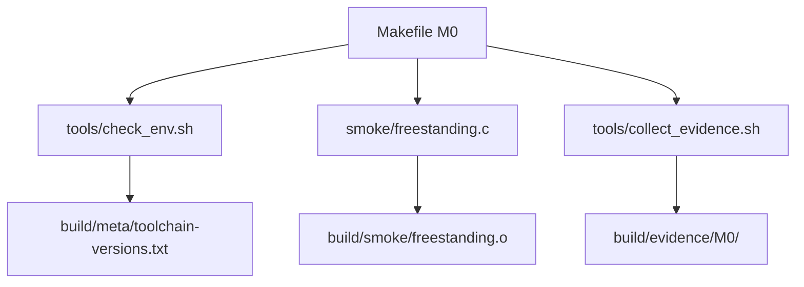

# M0 Dependency Graph

```mermaid
graph TD
    A[Makefile M0] --> B[tools/check_env.sh]
    A --> C[smoke/freestanding.c]
    B --> D[build/meta/toolchain-versions.txt]
    C --> E[build/smoke/freestanding.o]
    A --> F[tools/collect_evidence.sh]
    F --> G[build/evidence/M0/]
```
# M0 Dependency Graph

```mermaid
graph TD
    A[Makefile M0] --> B[tools/check_env.sh]
    A --> C[smoke/freestanding.c]
    B --> D[build/meta/toolchain-versions.txt]
    C --> E[build/smoke/freestanding.o]
    A --> F[tools/collect_evidence.sh]
    F --> G[build/evidence/M0/]
```
