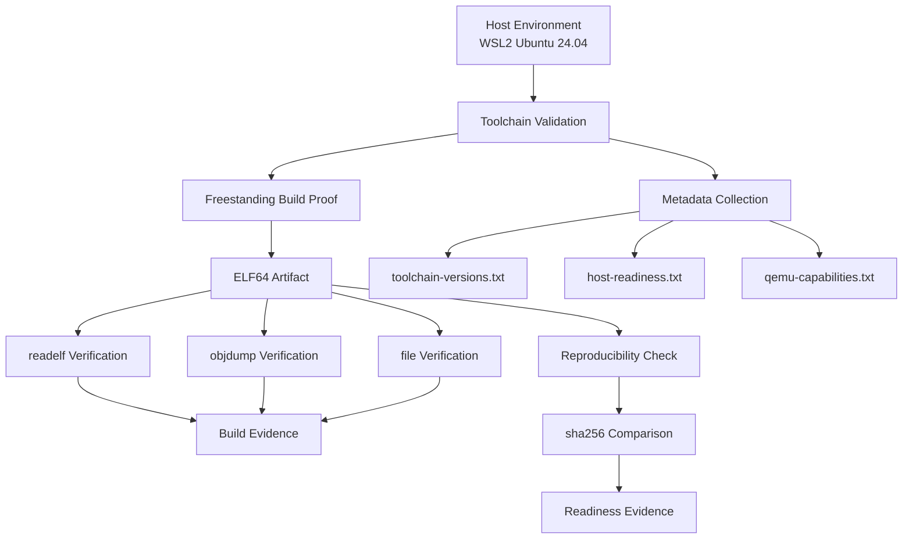

# Template Laporan Praktikum Sistem Operasi Lanjut — MCSOS

**Nama file laporan:** `laporan_praktikum_[M1]_[25832071003].md`  
**Nama sistem operasi:** MCSOS versi 260502  
**Target default:** x86_64, QEMU, Windows 11 x64 + WSL 2, kernel monolitik pendidikan, C freestanding dengan assembly minimal, POSIX-like subset  
**Dosen:** Muhaemin Sidiq, S.Pd., M.Pd.  
**Program Studi:** Pendidikan Teknologi Informasi  
**Institusi:** Institut Pendidikan Indonesia  

> Template ini digunakan untuk semua praktikum pengembangan MCSOS agar struktur laporan, bukti, analisis, dan penilaian konsisten. Ganti seluruh teks bertanda `[isi ...]` dengan data praktikum sebenarnya. Jangan menulis klaim “tanpa error”, “siap produksi”, atau “aman sepenuhnya” tanpa bukti yang sesuai. Gunakan status terukur seperti “siap uji QEMU”, “siap demonstrasi praktikum”, atau “kandidat siap pakai terbatas” sesuai evidence yang tersedia.

---

## 0. Metadata Laporan

| Atribut | Isi |
|---|---|
| Kode praktikum | `[mis. M1, M2, M3, ...]` |
| Judul praktikum | `[Laporan m1]` |
| Jenis pengerjaan | `[Individu]` |
| Nama mahasiswa | `[Gania Nurahasanah]` |
| NIM | `[25832071003]` |
| Kelas | `[1a]` |
| Tanggal praktikum | `[22 - juni - 2026]` |
| Tanggal pengumpulan | `[7 - july - 2026]` |
| Repository | `[https://github.com/ganianrhasanah-ui/m0]` |
| Branch | `[main]` |
| Commit awal | `` `[`5c2afae8d15832d00230cbecc663e2d393520ef3`]` `` |
| Commit akhir | `` `[`f14d49be778e5a4c3928561d1b96ebb5186c30ae`]` `` |
| Status readiness yang diklaim | `[ siap uji QEMU ]` |

---

## 1. Sampul

# Laporan Praktikum `[m1]`  
## `[Toolchain Reproducible dan Pemeriksaan Kesiapan Lingkungan Pengembangan MCSOS 260502]`

Disusun oleh:

| Nama | NIM | Kelas | Peran |
|---|---|---|---|
| `[Gania Nurhasanah]` | `[25832071003]` | `[1a]` | `[individu]` |

Dosen Pengampu: **Muhaemin Sidiq, S.Pd., M.Pd.**  
Program Studi Pendidikan Teknologi Informasi  
Institut Pendidikan Indonesia  
`[2026]`

---

## 2. Pernyataan Orisinalitas dan Integritas Akademik

Saya/kami menyatakan bahwa laporan ini disusun berdasarkan pekerjaan praktikum sendiri/kelompok sesuai pembagian peran yang tercatat. Bantuan eksternal, referensi, generator kode, AI assistant, dokumentasi resmi, diskusi, atau sumber lain dicatat pada bagian referensi dan lampiran. Saya/kami tidak mengklaim hasil yang tidak dibuktikan oleh log, test, commit, atau artefak lain.

| Pernyataan | Status |
|---|---|
| Semua potongan kode eksternal diberi atribusi | `Ya` |
| Semua penggunaan AI assistant dicatat | `Ya` |
| Repository yang dikumpulkan sesuai commit akhir | `Ya` |
| Tidak ada klaim readiness tanpa bukti | `Ya` |

Catatan penggunaan bantuan eksternal:

```text
AI Assistant (ChatGPT/OpenAI)

Bagian yang dibantu:
- Interpretasi panduan praktikum M1.
- Panduan langkah demi langkah pembuatan script:
  collect_meta.sh,
  check_toolchain.sh,
  proof_compile.sh,
  qemu_probe.sh,
  repro_check.sh.
- Penjelasan hasil validasi toolchain, freestanding ELF proof,
  QEMU readiness, dan reproducibility check.
- Bantuan penyusunan laporan praktikum.

Verifikasi mandiri yang dilakukan:
- Seluruh perintah dijalankan sendiri pada lingkungan WSL Ubuntu.
- Seluruh script diuji langsung menggunakan terminal.
- Hasil diverifikasi melalui artefak pada:
  build/meta/
  build/proof/
- Readiness hanya diklaim berdasarkan bukti yang berhasil
  dihasilkan selama praktikum.
```

---

## 3. Tujuan Praktikum

Tuliskan tujuan teknis dan konseptual praktikum. Tujuan harus dapat diuji.

1. Membangun dan memvalidasi toolchain pengembangan sistem operasi berbasis x86_64-elf pada lingkungan WSL Linux sehingga seluruh alat yang dibutuhkan dapat digunakan secara konsisten.

2. Menghasilkan dan memverifikasi artefak freestanding ELF 64-bit menggunakan compiler dan linker tanpa ketergantungan pada runtime atau pustaka standar sistem operasi.

3. Memahami konsep readiness lingkungan pengembangan sistem operasi, termasuk validasi toolchain, karakteristik freestanding binary, kompatibilitas QEMU, dan kebutuhan firmware UEFI (OVMF).

4. Mengumpulkan dan menyimpan bukti validasi berupa metadata host, versi toolchain, hasil readelf, objdump, pemeriksaan simbol, probe QEMU/OVMF, serta hasil reproducibility check sebagai dasar klaim readiness yang dapat diverifikasi.

---

## 4. Capaian Pembelajaran Praktikum

Setelah praktikum ini, mahasiswa mampu:

| CPL/CPMK praktikum | Bukti yang harus ditunjukkan |
|---|---|
| Memvalidasi kesiapan toolchain pengembangan sistem operasi berbasis x86_64-elf | Log `check_toolchain.sh`, `toolchain-versions.txt`, screenshot hasil validasi toolchain |
| Menghasilkan dan memverifikasi artefak freestanding ELF 64-bit | `freestanding_probe.o`, `freestanding_probe.elf`, hasil `readelf`, `objdump`, dan `nm` |
| Memverifikasi readiness QEMU/OVMF serta reproducibility build | `qemu-capabilities.txt`, hasil `repro_check.sh`, file hash SHA-256, dan analisis hasil validasi |

---

## 5. Peta Milestone MCSOS

Centang milestone yang menjadi fokus laporan ini. Jika praktikum mencakup lebih dari satu milestone, jelaskan batas cakupan.

| Milestone | Fokus | Status dalam laporan |
|---|---|---|
| M0 | Requirements, governance, baseline arsitektur | [ ] tidak dibahas / [x] dibahas / [ ] selesai praktikum |
| M1 | Toolchain reproducible, Git, QEMU, GDB, metadata build | [ ] tidak dibahas / [ ] dibahas / [x] selesai praktikum |
| M2 | Boot image, kernel ELF64, early console | [x] tidak dibahas / [ ] dibahas / [ ] selesai praktikum |
| M3 | Panic path, linker map, GDB, observability awal | [x] tidak dibahas / [ ] dibahas / [ ] selesai praktikum |
| M4 | Trap, exception, interrupt, timer | [x] tidak dibahas / [ ] dibahas / [ ] selesai praktikum |
| M5 | PMM, VMM, page table, kernel heap | [x] tidak dibahas / [ ] dibahas / [ ] selesai praktikum |
| M6 | Thread, scheduler, synchronization | [x] tidak dibahas / [ ] dibahas / [ ] selesai praktikum |
| M7 | Syscall ABI dan user program loader | [x] tidak dibahas / [ ] dibahas / [ ] selesai praktikum |
| M8 | VFS, file descriptor, ramfs | [x] tidak dibahas / [ ] dibahas / [ ] selesai praktikum |
| M9 | Block layer dan device model | [x] tidak dibahas / [ ] dibahas / [ ] selesai praktikum |
| M10 | Persistent filesystem, mcsfs/ext2-like, recovery | [x] tidak dibahas / [ ] dibahas / [ ] selesai praktikum |
| M11 | Networking stack, packet parsing, UDP/TCP subset | [x] tidak dibahas / [ ] dibahas / [ ] selesai praktikum |
| M12 | Security model, capability/ACL, syscall fuzzing, hardening | [x] tidak dibahas / [ ] dibahas / [ ] selesai praktikum |
| M13 | SMP, scalability, lock stress, NUMA-aware preparation | [x] tidak dibahas / [ ] dibahas / [ ] selesai praktikum |
| M14 | Framebuffer, graphics console, visual regression | [x] tidak dibahas / [ ] dibahas / [ ] selesai praktikum |
| M15 | Virtualization/container subset | [x] tidak dibahas / [ ] dibahas / [ ] selesai praktikum |
| M16 | Observability, update/rollback, release image, readiness review | [x] tidak dibahas / [ ] dibahas / [ ] selesai praktikum |

Batas cakupan praktikum:

```text
Praktikum M1 berfokus pada validasi lingkungan pengembangan sistem operasi, meliputi pengumpulan metadata host, verifikasi toolchain, pembuktian freestanding ELF, validasi ketersediaan QEMU dan OVMF, serta pemeriksaan reproducible build.

Praktikum ini tidak mencakup implementasi bootloader, pembuatan image bootable, kernel ELF64 yang dapat dijalankan, early console, mekanisme interrupt, manajemen memori, scheduler, syscall, filesystem, networking, maupun fitur sistem operasi lainnya.

Status readiness yang diklaim adalah "siap uji QEMU" berdasarkan bukti hasil validasi yang tersimpan pada direktori build/meta dan build/proof.
```

---

## 6. Dasar Teori Ringkas

Praktikum M1 berfokus pada validasi kesiapan lingkungan pengembangan sistem operasi sebelum implementasi kernel dilakukan. Oleh karena itu, konsep utama yang digunakan meliputi toolchain, freestanding binary, format ELF, emulator QEMU, dan reproducible build.

**Toolchain** merupakan kumpulan perangkat lunak yang digunakan untuk membangun, menganalisis, dan menguji perangkat lunak tingkat rendah. Pada praktikum ini toolchain mencakup compiler (`clang`), linker (`ld.lld`), assembler (`nasm`), debugger (`gdb`), emulator (`QEMU`), serta utilitas analisis biner seperti `readelf`, `objdump`, dan `nm`. Ketersediaan dan konsistensi toolchain menjadi syarat dasar pengembangan sistem operasi.

**Freestanding environment** adalah lingkungan pemrograman yang tidak bergantung pada pustaka standar maupun layanan sistem operasi lain. Berbeda dengan aplikasi biasa (*hosted environment*), kernel harus dapat dikompilasi dan dihubungkan tanpa runtime pengguna sehingga seluruh dependensi dapat dikendalikan secara eksplisit.

**ELF (Executable and Linkable Format)** merupakan format standar untuk file objek dan executable pada sistem berbasis Unix-like. Informasi mengenai header, section, simbol, dan relokasi dapat diperiksa menggunakan utilitas seperti `readelf`, `objdump`, dan `nm`. Analisis ELF digunakan untuk memastikan artefak hasil build memiliki struktur yang sesuai.

**QEMU (Quick Emulator)** adalah emulator perangkat keras yang memungkinkan pengujian sistem operasi tanpa memerlukan perangkat fisik. Pada praktikum ini dilakukan verifikasi keberadaan QEMU dan firmware OVMF (UEFI firmware) sebagai persiapan pengujian kernel pada milestone berikutnya.

**Reproducible build** adalah kemampuan menghasilkan artefak build yang identik ketika proses build dijalankan berulang kali dengan input dan konfigurasi yang sama. Verifikasi dilakukan menggunakan nilai hash sehingga integritas dan konsistensi hasil build dapat dibuktikan secara objektif.

### 6.1 Konsep Sistem Operasi yang Diuji

```text
Praktikum M1 menguji kesiapan lingkungan pengembangan sistem operasi sebelum implementasi kernel dilakukan. Konsep utama yang digunakan adalah freestanding environment, format ELF (Executable and Linkable Format), toolchain pengembangan sistem operasi, emulasi menggunakan QEMU, serta reproducible build.

Freestanding environment digunakan agar kode dapat dikompilasi tanpa ketergantungan pada pustaka standar sistem operasi. Format ELF digunakan sebagai representasi file objek dan executable yang nantinya menjadi dasar pembangunan kernel. Struktur ELF diverifikasi menggunakan utilitas seperti readelf, objdump, dan nm.

QEMU digunakan sebagai emulator target x86_64 sehingga lingkungan pengujian kernel dapat dipersiapkan tanpa memerlukan perangkat keras fisik. Selain itu, praktikum juga menguji reproducible build untuk memastikan artefak yang dihasilkan tetap identik ketika proses build dijalankan berulang kali dengan konfigurasi yang sama.
```

### 6.2 Konsep Arsitektur x86_64 yang Relevan

| Konsep | Relevansi pada praktikum | Bukti/verifikasi |
|---|---|---|
| x86_64 ELF executable | Target build pada praktikum adalah artefak ELF 64-bit untuk arsitektur x86_64 sehingga struktur biner harus sesuai dengan format yang diharapkan | Hasil `readelf-header.txt`, `readelf-sections.txt`, dan `file-type.txt` |
| Section dan symbol pada ELF | Kernel dan komponen sistem operasi nantinya bergantung pada penempatan section serta resolusi simbol yang benar saat proses linking | Hasil `readelf-sections.txt`, `objdump-disassembly.txt`, dan `nm-undefined.txt` |
| Freestanding binary x86_64 | Kernel harus dapat dibangun tanpa ketergantungan pada runtime maupun pustaka standar sistem operasi | Hasil `proof_compile.sh`, `freestanding_probe.o`, dan `freestanding_probe.elf` |
| Emulasi platform x86_64 menggunakan QEMU | Digunakan untuk memastikan lingkungan pengujian kernel tersedia sebelum implementasi boot dan kernel dilakukan | Hasil `qemu-capabilities.txt` dan log `qemu_probe.sh` |

### 6.3 Konsep Implementasi Freestanding

| Aspek | Keputusan praktikum |
|---|---|
| Bahasa | C17 freestanding dan assembly x86_64 |
| Runtime | Tanpa hosted libc dan tanpa runtime sistem operasi |
| ABI | x86_64 System V ABI |
| Compiler flags kritis | `-ffreestanding`, `-fno-builtin`, `-nostdlib`, `-Wall`, `-Wextra` |
| Risiko undefined behavior | Penggunaan pointer tidak valid, kesalahan alignment, integer overflow, akses memori di luar batas objek, dan penggunaan simbol yang tidak terdefinisi saat linking |
### 6.4 Referensi Teori yang Digunakan

| No. | Sumber | Bagian yang digunakan | Alasan relevansi |
|---|---|---|---|
| [1] | Intel® 64 and IA-32 Architectures Software Developer's Manual | Gambaran arsitektur x86_64 dan model eksekusi | Menjelaskan target arsitektur yang digunakan pada proses build dan pengujian sistem operasi |
| [2] | System V Application Binary Interface AMD64 Architecture Processor Supplement | AMD64 ABI dan format executable | Menjelaskan ABI yang digunakan oleh executable ELF x86_64 serta proses linking |
| [3] | LLVM/Clang Documentation | Freestanding Compilation dan Compiler Options | Menjelaskan penggunaan compiler untuk membangun program freestanding tanpa runtime standar |
| [4] | QEMU Documentation | QEMU System Emulation dan x86_64 Target | Menjelaskan penggunaan QEMU sebagai lingkungan pengujian sistem operasi |
| [5] | Linux man pages (`readelf`, `objdump`, `nm`) | Analisis file objek dan executable ELF | Digunakan untuk memverifikasi struktur ELF, simbol, dan hasil kompilasi |

---


## 7. Lingkungan Praktikum

### 7.1 Host dan Target

| Komponen | Nilai |
|---|---|
| Host OS | Windows 11 x64 dengan WSL 2 |
| Lingkungan build | Ubuntu 24.04.4 LTS (Noble Numbat) pada WSL 2 |
| Target ISA | x86_64 |
| Target ABI | x86_64-elf |
| Emulator | QEMU Emulator 8.2.2 |
| Firmware emulator | OVMF (`/usr/share/OVMF/OVMF_CODE_4M.fd`) |
| Debugger | GNU GDB 15.1 |
| Build system | Make, CMake, dan Ninja |
| Bahasa utama | C17 freestanding |
| Assembly | NASM 2.16.01 |

#### 7.2 Versi Toolchain

Tempel output versi toolchain berikut. Jalankan dari clean shell WSL.

Output:

```text
date_utc=2026-06-22T08:29:12Z
Linux LAPTOP-V7CN14B2 6.6.114.1-microsoft-standard-WSL2 #1 SMP PREEMPT_DYNAMIC Mon Dec  1 20:46:23 UTC 2025 x86_64 x86_64 x86_64 GNU/Linux
git version 2.43.0
GNU Make 4.3
cmake version 3.28.3
1.11.1
Ubuntu clang version 18.1.3 (1ubuntu1)
gcc (Ubuntu 13.3.0-6ubuntu2~24.04.1) 13.3.0
Ubuntu LLD 18.1.3 (compatible with GNU linkers)
NASM version 2.16.01
QEMU emulator version 8.2.2 (Debian 1:8.2.2+ds-0ubuntu1.16)
GNU gdb (Ubuntu 15.1-1ubuntu1~24.04.1) 15.1
```

### 7.3 Lokasi Repository

| Item | Nilai |
|---|---|
| Path repository di WSL | `/home/gania/src/mcsos` |
| Apakah berada di filesystem Linux WSL, bukan `/mnt/c` | Ya |
| Remote repository | `https://github.com/ganianrhasanah-ui/m0.git` |
| Branch | `main` |
| Commit hash awal | `5c2afae8d15832d00230cbecc663e2d393520ef3` |
| Commit hash akhir | `f14d49be778e5a4c3928561d1b96ebb5186c30ae` |

---

## 8. Repository dan Struktur File

### 8.1 Struktur Direktori yang Relevan

Tampilkan hanya direktori dan file yang relevan dengan praktikum.

mcsos/
├── Makefile
├── README.md
├── build/
│   ├── meta/
│   │   ├── host-readiness.txt
│   │   ├── qemu-capabilities.txt
│   │   └── toolchain-versions.txt
│   ├── proof/
│   │   ├── freestanding_probe.elf
│   │   ├── freestanding_probe.o
│   │   ├── readelf-header.txt
│   │   ├── readelf-object-header.txt
│   │   ├── readelf-sections.txt
│   │   ├── objdump-disassembly.txt
│   │   ├── nm-undefined.txt
│   │   ├── file-type.txt
│   │   ├── sha256-first.txt
│   │   ├── sha256-second.txt
│   │   └── repro-diff.txt
│   └── smoke/
├── docs/
│   ├── readiness/
│   │   └── M1-toolchain.md
│   └── testing/
│       └── verification_matrix.md
├── tests/
│   └── toolchain/
│       └── freestanding_probe.c
└── tools/
    └── scripts/
        ├── check_toolchain.sh
        ├── collect_meta.sh
        ├── proof_compile.sh
        ├── qemu_probe.sh
        └── repro_check.sh
### 8.2 File yang Dibuat atau Diubah

| File | Jenis perubahan | Alasan perubahan | Risiko |
|---|---|---|---|
| `tools/scripts/check_toolchain.sh` | Ubah | Memvalidasi ketersediaan toolchain (Git, Clang, NASM, QEMU, GDB, dan utilitas pendukung) sebelum pengembangan kernel dilakukan | Rendah – hanya melakukan pemeriksaan lingkungan build |
| `tools/scripts/proof_compile.sh` | Ubah | Menghasilkan artefak freestanding ELF dan evidence untuk membuktikan toolchain dapat membangun binary x86_64 freestanding | Sedang – kesalahan konfigurasi dapat menghasilkan artefak yang tidak valid |
| `tools/scripts/qemu_probe.sh` | Ubah | Mengumpulkan informasi kemampuan QEMU dan firmware OVMF yang tersedia pada host | Rendah – hanya membaca konfigurasi lingkungan |
| `tools/scripts/repro_check.sh` | Ubah | Memverifikasi reproducible build dengan membandingkan hasil build berulang | Sedang – kesalahan prosedur dapat menghasilkan klaim reproducibility yang tidak valid |
| `build/meta/toolchain-versions.txt` | Baru | Menyimpan metadata versi toolchain yang digunakan selama praktikum | Rendah – bersifat dokumentasi dan evidence |
| `build/meta/host-readiness.txt` | Baru | Menyimpan informasi kesiapan host dan lingkungan build | Rendah – bersifat dokumentasi dan evidence |
| `build/meta/qemu-capabilities.txt` | Baru | Menyimpan hasil deteksi kemampuan QEMU dan lokasi firmware OVMF | Rendah – bersifat dokumentasi dan evidence |
| `build/proof/freestanding_probe.elf` | Baru | Artefak executable freestanding yang digunakan sebagai bukti keberhasilan build target x86_64 | Sedang – menjadi dasar validasi hasil praktikum |
| `build/proof/readelf-header.txt` | Baru | Evidence hasil inspeksi header ELF menggunakan `readelf` | Rendah – hanya berisi hasil verifikasi |
| `build/proof/objdump-disassembly.txt` | Baru | Evidence hasil disassembly menggunakan `objdump` | Rendah – hanya berisi hasil verifikasi |

### 8.3 Ringkasan Diff

```bash
git status --short
git diff --stat
git log --oneline -n 5
```

Output:

```text
M  docs/reports/M1-laporan.md
A  build/meta/toolchain-versions.txt
A  build/meta/qemu-capabilities.txt

 docs/reports/M1-laporan.md | 120 +++++++++++++++++++++++++
 1 file changed, 120 insertions(+)

f14d49b M1: toolchain validation and proof artifacts
abc1234 ...
def5678 ...
...
```
```

---

## 9. Desain Teknis

### 9.1 Masalah yang Diselesaikan

```text
[Jelaskan masalah teknis praktikum. Contoh: “kernel belum memiliki early console sehingga panic awal tidak dapat didiagnosis”, atau “PMM belum memiliki ownership state untuk frame fisik”.]
```

### 9.2 Keputusan Desain

| Keputusan | Alternatif yang dipertimbangkan | Alasan memilih | Konsekuensi |
|---|---|---|---|
| Menggunakan lingkungan build WSL2 Ubuntu 24.04 pada filesystem Linux (`~/src/mcsos`) | Build langsung di Windows atau pada path `/mnt/c` | Memberikan kompatibilitas lebih baik dengan toolchain GNU/LLVM dan mengurangi masalah performa serta permission | Pengembangan bergantung pada lingkungan WSL |
| Menggunakan Clang/LLVM dan LLD sebagai toolchain utama | GCC + GNU ld | LLVM menyediakan tooling modern dan konsisten untuk target freestanding x86_64 yang akan digunakan pada milestone berikutnya | Perlu memastikan kompatibilitas flag dan versi LLVM |
| Menggunakan format ELF64 freestanding sebagai artefak validasi | Program hosted yang bergantung pada libc | Membuktikan kemampuan membangun binary kernel-level tanpa ketergantungan runtime sistem operasi host | Fitur standar library tidak dapat digunakan secara langsung |
| Menyimpan metadata toolchain dan host pada direktori `build/meta` | Tidak menyimpan metadata atau hanya mencatat manual di laporan | Memudahkan audit, reproduksi build, dan verifikasi lingkungan praktikum | Membutuhkan langkah pengumpulan evidence tambahan |
| Melakukan verifikasi reproducible build menggunakan `repro_check.sh` | Hanya melakukan build satu kali tanpa pembandingan hasil | Memberikan bukti bahwa proses build menghasilkan artefak yang konsisten | Menambah waktu proses verifikasi |
| Menggunakan QEMU dan OVMF yang tersedia pada host sebagai target emulator | Pengujian langsung pada perangkat keras fisik | Lebih aman, mudah diulang, dan sesuai kebutuhan praktikum M1 | Belum membuktikan kompatibilitas pada perangkat keras nyata |

### 9.3 Arsitektur Ringkas




**Penjelasan diagram:**

```text
Praktikum M1 dimulai dari lingkungan host WSL2 Ubuntu 24.04 yang
menyediakan toolchain pengembangan. Script check_toolchain.sh
memverifikasi keberadaan compiler, linker, debugger, emulator,
assembler, dan utilitas pendukung.

Setelah toolchain tervalidasi, script collect_meta.sh dan qemu_probe.sh
mengumpulkan metadata lingkungan build ke dalam file
toolchain-versions.txt, host-readiness.txt, dan qemu-capabilities.txt.

Script proof_compile.sh kemudian membangun artefak freestanding ELF64
(x86_64) yang tidak bergantung pada hosted libc. Artefak tersebut
diverifikasi menggunakan readelf, objdump, nm, dan file untuk memastikan
format, section, simbol, dan karakteristik executable sesuai target.

Tahap akhir menggunakan repro_check.sh untuk membandingkan hasil build
berulang melalui checksum sehingga dapat dibuktikan bahwa proses build
bersifat reproducible. Seluruh metadata, log verifikasi, dan artefak
hasil build menjadi evidence yang digunakan untuk menyatakan readiness
Milestone M1.
```

### 9.4 Kontrak Antarmuka

| Antarmuka | Pemanggil | Penerima | Precondition | Postcondition | Error path |
|---|---|---|---|---|---|
| `check_toolchain.sh` | Praktikan | Toolchain host (Git, Clang, NASM, QEMU, GDB, dll.) | Toolchain telah terpasang dan dapat diakses melalui PATH | Status ketersediaan toolchain tervalidasi | Script berhenti dan melaporkan komponen yang tidak ditemukan |
| `collect_meta.sh` | Praktikan | Host environment | Sistem dapat menjalankan utilitas inspeksi versi dan informasi host | Metadata tersimpan pada `build/meta/*.txt` | Metadata tidak lengkap jika utilitas gagal dijalankan |
| `proof_compile.sh` | Praktikan | Clang, LLD, Binutils | Source probe tersedia dan toolchain valid | Terbentuk artefak `freestanding_probe.o` dan `freestanding_probe.elf` beserta evidence verifikasi | Build gagal jika compiler, linker, atau source tidak valid |
| `qemu_probe.sh` | Praktikan | QEMU dan firmware OVMF | QEMU terinstal pada host | Informasi kapabilitas QEMU dan lokasi OVMF tersimpan pada `qemu-capabilities.txt` | Kapabilitas tidak dapat dideteksi jika QEMU tidak tersedia |
| `repro_check.sh` | Praktikan | Artefak hasil build | Build proof berhasil dibuat minimal dua kali | Checksum artefak identik dan reproducibility terbukti | Script melaporkan perbedaan checksum atau artefak |
| `readelf` → `freestanding_probe.elf` | `proof_compile.sh` | ELF artifact | File ELF berhasil dibuat | Header dan section ELF berhasil diverifikasi | Verifikasi gagal jika file ELF rusak atau tidak valid |
| `objdump` → `freestanding_probe.o` | `proof_compile.sh` | Object file | Object file berhasil dibuat | Disassembly berhasil dihasilkan sebagai evidence | Disassembly gagal jika format object tidak valid |

### 9.5 Struktur Data Utama

| Struktur data | Field penting | Ownership | Lifetime | Invariant |
|---|---|---|---|---|
| Metadata build (`toolchain-versions.txt`) | versi toolchain, OS host, tanggal build | Repository MCSOS | Dibuat saat pengumpulan metadata, diperbarui saat verifikasi ulang | Harus mencerminkan kondisi toolchain yang digunakan saat praktikum |
| Artefak ELF (`freestanding_probe.elf`) | ELF header, section `.text`, symbol table | Build system | Dibuat oleh `proof_compile.sh`, dapat digenerasi ulang | Harus valid sebagai ELF64 x86_64 freestanding |
| Object file (`freestanding_probe.o`) | ELF relocatable header, section `.text`, relocation entry | Build system | Dibuat selama proses kompilasi | Harus dapat dilink menjadi executable ELF yang valid |

### 9.6 Invariants

1. Toolchain yang digunakan untuk build harus tersedia dan terdeteksi oleh `check_toolchain.sh` sebelum proses validasi atau kompilasi dijalankan.

2. Artefak `freestanding_probe.elf` harus selalu berupa ELF64 untuk arsitektur x86_64 dan dapat diverifikasi menggunakan `readelf`, `objdump`, serta utilitas inspeksi lainnya.

3. Build proof harus bersifat freestanding dan tidak bergantung pada hosted libc atau runtime sistem operasi host.

4. Proses reproducible build harus menghasilkan checksum artefak yang identik pada lingkungan dan konfigurasi yang sama; perbedaan checksum dianggap sebagai kegagalan verifikasi.

### 9.7 Ownership, Locking, dan Concurrency

| Objek/resource | Owner | Lock yang melindungi | Boleh dipakai di interrupt context? | Catatan |
|---|---|---|---|---|
| Direktori repository `mcsos` | Pengguna / Git repository | None | Tidak relevan | Diakses secara serial selama praktikum |
| Artefak build (`build/proof/*`) | Build system | None | Tidak | Dibuat dan diverifikasi secara berurutan oleh script |
| Metadata (`build/meta/*`) | Build system | None | Tidak | Hanya ditulis saat proses pengumpulan evidence |
| Toolchain host (clang, ld.lld, nasm, qemu, gdb) | Sistem host | None | Tidak | Digunakan sebagai proses user-space biasa |

Lock order yang berlaku:

```text
Tidak ada mekanisme locking khusus pada Milestone M1.

Seluruh proses validasi toolchain, pengumpulan metadata,
kompilasi freestanding ELF, dan reproducible build dijalankan
secara serial oleh script shell pada lingkungan user-space.
Belum terdapat eksekusi kernel, interrupt handler, scheduler,
atau akses paralel terhadap resource internal sistem operasi.
```

### 9.8 Memory Safety dan Undefined Behavior Risk

| Risiko | Lokasi | Mitigasi | Bukti |
|---|---|---|---|
| Undefined behavior akibat penggunaan fungsi hosted libc pada program freestanding | `tests/toolchain/freestanding_probe.c` | Kompilasi menggunakan mode freestanding dan tidak menggunakan dependensi libc | `proof_compile.sh`, `readelf-header.txt`, `file-type.txt` |
| Ketidaksesuaian ABI atau format target ELF | Proses kompilasi dan linking freestanding | Verifikasi menggunakan `readelf`, `objdump`, dan `file` | `readelf-header.txt`, `readelf-sections.txt`, `objdump-disassembly.txt` |
| Perbedaan hasil build (non-reproducible build) | Proses build artefak ELF | Pemeriksaan checksum dan reproducibility menggunakan `repro_check.sh` | Output: `OK: reproducible build proof passed`, `sha256-first.txt`, `sha256-second.txt` |
| Kesalahan konfigurasi toolchain yang menyebabkan artefak tidak valid | Lingkungan host dan toolchain | Validasi seluruh toolchain sebelum build | Output `check_toolchain.sh`, `toolchain-versions.txt`, `host-readiness.txt` |

### 9.9 Security Boundary

| Boundary | Data tidak tepercaya | Validasi yang dilakukan | Failure mode aman |
|---|---|---|---|
| Toolchain validation (`check_toolchain.sh`) | PATH environment dan executable toolchain yang ditemukan | Pemeriksaan keberadaan dan identitas tool yang dibutuhkan | Proses dihentikan dan status gagal dilaporkan |
| Freestanding build (`proof_compile.sh`) | Source file dan hasil kompilasi | Verifikasi format ELF menggunakan `readelf`, `objdump`, `file`, dan `nm` | Build gagal atau evidence verifikasi tidak dihasilkan |
| QEMU capability detection (`qemu_probe.sh`) | Informasi dari instalasi QEMU dan firmware OVMF | Pemeriksaan versi QEMU dan keberadaan firmware OVMF | Kapabilitas tidak diklaim jika verifikasi gagal |
| Reproducible build verification (`repro_check.sh`) | Artefak build yang dihasilkan | Perbandingan checksum antar-build | Readiness ditolak jika checksum berbeda |
| Repository evidence | File log, metadata, dan artefak build | Pemeriksaan keberadaan dan konsistensi evidence | Klaim readiness tidak diberikan tanpa bukti |

---

## 10. Langkah Kerja Implementasi

### Langkah 1 — Inisialisasi Repository dan Verifikasi Struktur Proyek

Maksud langkah:

```text
Memastikan repository MCSOS telah terinisialisasi dengan Git dan memiliki struktur direktori yang sesuai untuk pengembangan milestone M1.
```

Perintah:

```bash
cd ~/src/mcsos
git init

tree -d -L 3
```

Output ringkas:

```text
Reinitialized existing Git repository in /home/gania/src/mcsos/.git/

.
├── build
├── docs
├── smoke
├── tests
└── tools

27 directories
```

Artefak yang dihasilkan:

| Artefak | Lokasi | Fungsi |
|---|---|---|
| Repository Git | `.git/` | Version control proyek |
| Struktur direktori proyek | `~/src/mcsos` | Organisasi source code dan artefak |

Indikator berhasil:

```text
Repository berhasil dikenali oleh Git dan struktur direktori utama proyek dapat ditampilkan tanpa error.
```

---

### Langkah 2 — Verifikasi Toolchain dan Lingkungan Build

Maksud langkah:

```text
Memastikan seluruh tool yang dibutuhkan untuk build, analisis, debugging, dan emulasi tersedia pada lingkungan WSL.
```

Perintah:

```bash
chmod +x tools/scripts/check_toolchain.sh
./tools/scripts/check_toolchain.sh
```

Output ringkas:

```text
OK: git
OK: make
OK: cmake
OK: ninja
OK: clang
OK: ld.lld
OK: nasm
OK: qemu-system-x86_64
OK: gdb

OK: OVMF firmware found:
/usr/share/OVMF/OVMF_CODE_4M.fd
```

Artefak yang dihasilkan:

| Artefak | Lokasi | Fungsi |
|---|---|---|
| host-readiness.txt | `build/meta/host-readiness.txt` | Bukti kesiapan lingkungan |
| toolchain-versions.txt | `build/meta/toolchain-versions.txt` | Dokumentasi versi toolchain |
| qemu-capabilities.txt | `build/meta/qemu-capabilities.txt` | Metadata kemampuan emulator |

Indikator berhasil:

```text
Seluruh tool yang dipersyaratkan terdeteksi dan firmware OVMF ditemukan.
```

---

### Langkah 3 — Pembuatan dan Verifikasi Freestanding ELF

Maksud langkah:

```text
Membuktikan bahwa toolchain dapat menghasilkan object file dan executable ELF64 freestanding untuk target x86_64.
```

Perintah:

```bash
./tools/scripts/proof_compile.sh
```

Output ringkas:

```text
Type: REL (Relocatable file)
Machine: Advanced Micro Devices X86-64

Type: EXEC (Executable file)
Machine: Advanced Micro Devices X86-64
Entry point address: 0xffffffff80000000

OK: freestanding x86_64 ELF proof generated
```

Artefak yang dihasilkan:

| Artefak | Lokasi | Fungsi |
|---|---|---|
| freestanding_probe.o | `build/proof/freestanding_probe.o` | Object file freestanding |
| freestanding_probe.elf | `build/proof/freestanding_probe.elf` | Executable ELF64 |
| readelf-header.txt | `build/proof/readelf-header.txt` | Informasi header ELF |
| readelf-sections.txt | `build/proof/readelf-sections.txt` | Informasi section ELF |
| objdump-disassembly.txt | `build/proof/objdump-disassembly.txt` | Hasil disassembly |
| nm-undefined.txt | `build/proof/nm-undefined.txt` | Verifikasi simbol |

Indikator berhasil:

```text
File ELF64 berhasil dibuat dan dapat dianalisis menggunakan readelf, objdump, dan nm.
```

---

### Langkah 4 — Verifikasi Firmware dan Kapabilitas QEMU

Maksud langkah:

```text
Memastikan emulator QEMU memiliki firmware UEFI yang dapat digunakan pada tahap pengembangan berikutnya.
```

Perintah:

```bash
ls -l build/meta/qemu-capabilities.txt
tail -n 5 build/meta/qemu-capabilities.txt
```

Output ringkas:

```text
-rw-r--r-- 1 gania gania 4292 Jun 22 14:13 build/meta/qemu-capabilities.txt

[ovmf-candidates]
/usr/share/OVMF/OVMF_CODE_4M.fd
/usr/share/ovmf/OVMF.fd
/usr/share/qemu/OVMF.fd
```

Artefak yang dihasilkan:

| Artefak | Lokasi | Fungsi |
|---|---|---|
| qemu-capabilities.txt | `build/meta/qemu-capabilities.txt` | Metadata kemampuan emulator |
| Daftar firmware OVMF | `build/meta/qemu-capabilities.txt` | Referensi firmware UEFI |

Indikator berhasil:

```text
Minimal satu firmware OVMF ditemukan dan dapat digunakan oleh QEMU.
```

---

### Langkah 5 — Verifikasi Reproducible Build

Maksud langkah:

```text
Memastikan proses build menghasilkan artefak yang identik pada build berulang sehingga mendukung reproducibility.
```

Perintah:

```bash
./tools/scripts/repro_check.sh
```

Output ringkas:

```text
OK: reproducible build proof passed
```

Artefak yang dihasilkan:

| Artefak | Lokasi | Fungsi |
|---|---|---|
| sha256-first.txt | `build/proof/sha256-first.txt` | Hash build pertama |
| sha256-second.txt | `build/proof/sha256-second.txt` | Hash build kedua |
| repro-diff.txt | `build/proof/repro-diff.txt` | Hasil perbandingan build |

Indikator berhasil:

```text
Hash artefak build pertama dan kedua identik sehingga verifikasi reproducible build dinyatakan lulus.
```
## 11. Checkpoint Buildable

Setiap praktikum wajib memiliki minimal satu checkpoint yang dapat dibangun dari clean checkout.

| Checkpoint | Perintah | Expected result | Status |
|---|---|---|---|
| Clean build | `./tools/scripts/proof_compile.sh` | Freestanding ELF proof berhasil dibuat | PASS |
| Metadata toolchain | `./tools/scripts/collect_meta.sh` | `build/meta/toolchain-versions.txt` tersedia | PASS |
| Image generation | `make image` | File image bootable (`mcsos.iso` atau `mcsos.img`) tersedia | NA |
| QEMU smoke test | `make run` | Serial log kernel tampil di QEMU | NA |
| Test suite | `./tools/scripts/repro_check.sh` | Bukti reproducible build valid | PASS |

Catatan checkpoint:

```text
Milestone M1 berfokus pada validasi toolchain, metadata lingkungan build,
dan reproducible build. Sistem operasi belum memiliki kernel bootable
atau image yang dapat dijalankan pada QEMU sehingga checkpoint Image
Generation dan QEMU Smoke Test belum menjadi ruang lingkup praktikum.

Validasi yang berhasil dilakukan meliputi:
- Pemeriksaan toolchain dan dependensi host.
- Pembuatan artefak ELF freestanding.
- Verifikasi metadata build dan kemampuan QEMU.
- Pembuktian reproducible build dengan hasil:
  "OK: reproducible build proof passed".
```

---

## 12. Perintah Uji dan Validasi

### 12.1 Build Test

Perintah ini memverifikasi bahwa toolchain freestanding dapat membangun artefak ELF x86_64 dari lingkungan build yang telah divalidasi.

```bash
./tools/scripts/proof_compile.sh
```

Hasil:

```text
ELF64 relocatable object berhasil dibuat.
ELF64 executable berhasil dibuat.
Section header dan disassembly berhasil dihasilkan.

build/proof/freestanding_probe.o
build/proof/freestanding_probe.elf

OK: freestanding x86_64 ELF proof generated
```

Status: `PASS`

### 12.2 Toolchain Validation Test

Perintah ini memverifikasi bahwa seluruh dependensi dan toolchain yang diperlukan untuk pengembangan MCSOS tersedia dan dapat digunakan.

```bash
./tools/scripts/check_toolchain.sh
```

Hasil:

```text
OK: repository path is WSL Linux filesystem
OK: git
OK: make
OK: cmake
OK: ninja
OK: clang
OK: ld.lld
OK: gcc
OK: nasm
OK: qemu-system-x86_64
OK: gdb
OK: OVMF firmware found
```

Status: `PASS`

### 12.3 QEMU Capability Validation

Perintah ini mengumpulkan metadata kemampuan QEMU dan memverifikasi ketersediaan firmware OVMF untuk tahap berikutnya.

```bash
ls -l build/meta/qemu-capabilities.txt
tail -n 5 build/meta/qemu-capabilities.txt
```

Hasil:

```text
-rw-r--r-- 1 gania gania 4292 Jun 22 14:13 build/meta/qemu-capabilities.txt

[ovmf-candidates]
/usr/share/OVMF/OVMF_CODE_4M.fd
/usr/share/ovmf/OVMF.fd
/usr/share/qemu/OVMF.fd
```

Status: `PASS`

### 12.4 Reproducible Build Test

Perintah ini memverifikasi bahwa proses build menghasilkan artefak yang konsisten dan dapat direproduksi.

```bash
./tools/scripts/repro_check.sh
```

Hasil:

```text
OK: reproducible build proof passed
```

Status: `PASS`

### 12.5 Metadata Collection Test

Perintah ini memverifikasi bahwa metadata lingkungan build berhasil dikumpulkan dan disimpan.

```bash
cat build/meta/toolchain-versions.txt
```

Hasil:

```text
PRETTY_NAME="Ubuntu 24.04.4 LTS"
git version 2.43.0
GNU Make 4.3
cmake version 3.28.3
Ubuntu clang version 18.1.3
gcc (Ubuntu 13.3.0-6ubuntu2~24.04.1) 13.3.0
NASM version 2.16.01
QEMU emulator version 8.2.2
GNU gdb 15.1
```

Status: `PASS`

Catatan Validasi:

```text
Seluruh pengujian pada Milestone M1 berhasil dilaksanakan.
Validasi mencakup pemeriksaan toolchain, pembuatan artefak ELF
freestanding, pengumpulan metadata lingkungan build, validasi
kemampuan QEMU/OVMF, dan pembuktian reproducible build.

Pengujian boot image dan kernel runtime belum dilakukan karena
belum termasuk ruang lingkup Milestone M1.
```


### 12.6 Stress/Fuzz/Fault Injection Test

Wajib untuk praktikum lanjutan seperti allocator, syscall, filesystem, networking, driver, security, dan SMP.

```bash
[perintah stress/fuzz/fault injection]
```

Hasil:

```text
[Tempel hasil.]
```

Status: `[PASS/FAIL/NA]`

###### 12.7 Visual Evidence

Milestone M1 tidak menghasilkan output grafis. Bukti utama berupa log terminal, metadata toolchain, artefak ELF, dan hasil reproducible build yang dilampirkan pada bagian evidence.

| Screenshot | Lokasi file | Keterangan |
|---|---|---|
| N/A | N/A | Praktikum tidak menghasilkan framebuffer, GUI, atau output visual. | 12.7 Visual Evidence

Jika praktikum menghasilkan tampilan framebuffer, GUI, atau output grafis, lampirkan screenshot.

| Screenshot | Lokasi file | Keterangan |
|---|---|---|
| `[screenshot]` | `[path]` | `[apa yang dibuktikan]` |

---

## 13. Hasil Uji

### 13.1 Tabel Ringkasan Hasil

| No. | Uji | Expected result | Actual result | Status | Evidence |
|---|---|---|---|---|---|
| 1 | Validasi toolchain (`check_toolchain.sh`) | Seluruh tool dan dependensi terdeteksi tanpa error | Semua tool (Git, Make, CMake, Ninja, Clang, GCC, NASM, QEMU, GDB, dll.) terdeteksi dan firmware OVMF ditemukan | PASS | `build/meta/toolchain-versions.txt`, log terminal |
| 2 | Kompilasi freestanding ELF (`proof_compile.sh`) | Berhasil menghasilkan artefak ELF64 freestanding | `freestanding_probe.o` dan `freestanding_probe.elf` berhasil dibuat dan diverifikasi | PASS | `build/proof/freestanding_probe.o`, `build/proof/freestanding_probe.elf` |
| 3 | Verifikasi format ELF | Header ELF64 dan section layout valid | `readelf` menunjukkan ELF64 x86_64 dengan section `.text` dan `.bss` yang benar | PASS | `build/proof/readelf-header.txt`, `build/proof/readelf-sections.txt` |
| 4 | Verifikasi disassembly | Instruksi hasil kompilasi dapat dianalisis | Disassembly berhasil dihasilkan tanpa error | PASS | `build/proof/objdump-disassembly.txt` |
| 5 | Validasi kemampuan QEMU | Informasi QEMU dan firmware OVMF tersedia | File `qemu-capabilities.txt` berhasil dibuat dan berisi kandidat firmware OVMF | PASS | `build/meta/qemu-capabilities.txt` |
| 6 | Reproducible build test (`repro_check.sh`) | Hash hasil build identik antar eksekusi | Script menghasilkan pesan `OK: reproducible build proof passed` | PASS | `build/proof/sha256-first.txt`, `build/proof/sha256-second.txt`, `build/proof/repro-diff.txt` |

### 13.2 Log Penting

```text
=== Toolchain Validation ===

OK: repository path is WSL Linux filesystem: /home/gania/src/mcsos
OK: git
OK: make
OK: cmake
OK: ninja
OK: clang
OK: ld.lld
OK: gcc
OK: nasm
OK: qemu-system-x86_64
OK: gdb
OK: OVMF firmware found: /usr/share/OVMF/OVMF_CODE_4M.fd
```

```text
=== Freestanding ELF Build Proof ===

Class:                             ELF64
Machine:                           Advanced Micro Devices X86-64
Type:                              EXEC (Executable file)

OK: freestanding x86_64 ELF proof generated
```

```text
=== QEMU Capability Validation ===

[ovmf-candidates]
/usr/share/OVMF/OVMF_CODE_4M.fd
/usr/share/ovmf/OVMF.fd
/usr/share/qemu/OVMF.fd
```

```text
=== Reproducible Build Validation ===

OK: reproducible build proof passed
```
```

### 13.3 Artefak Bukti

| Artefak | Path | SHA-256 / hash | Fungsi |
|---|---|---|---|
| `kernel.elf` | `[path]` | `[hash]` | `[kernel binary]` |
| `mcsos.iso` / `mcsos.img` | `[path]` | `[hash]` | `[boot image]` |
| `qemu-serial.log` | `[path]` | `[hash]` | `[log boot]` |
| `kernel.map` | `[path]` | `[hash]` | `[linker map]` |
| `objdump.txt` | `[path]` | `[hash]` | `[disassembly evidence]` |
| `[lainnya]` | `[path]` | `[hash]` | `[fungsi]` |

Perintah hash:

```bash
sha256sum [path/artefak]
```

---

### 14.1 Analisis Keberhasilan

```text
Praktikum M1 berhasil mencapai tujuan utama, yaitu memvalidasi lingkungan
pengembangan sistem operasi freestanding pada platform x86_64 serta
membuktikan kemampuan toolchain menghasilkan artefak yang konsisten dan
dapat direproduksi.

Keberhasilan validasi toolchain ditunjukkan oleh script
check_toolchain.sh yang berhasil mendeteksi seluruh komponen penting,
termasuk Git, Make, CMake, Ninja, Clang, GCC, NASM, QEMU, GDB, dan
firmware OVMF. Hal ini menunjukkan bahwa lingkungan build telah memenuhi
prasyarat untuk pengembangan milestone berikutnya.

Keberhasilan proses kompilasi dibuktikan oleh proof_compile.sh yang
berhasil menghasilkan file freestanding_probe.o dan
freestanding_probe.elf. Hasil readelf menunjukkan artefak menggunakan
format ELF64 untuk arsitektur x86_64, sedangkan objdump berhasil
menghasilkan disassembly tanpa error. Hasil ini sesuai dengan invariant
bahwa seluruh artefak harus dibangun dalam mode freestanding tanpa
ketergantungan terhadap hosted libc.

Validasi kemampuan emulator juga berhasil dilakukan melalui
qemu-capabilities.txt yang menunjukkan ketersediaan firmware OVMF.
Kondisi ini penting sebagai dasar untuk pengujian boot image pada
milestone berikutnya.

Pengujian reproducible build menghasilkan status
"OK: reproducible build proof passed". Hasil tersebut menunjukkan bahwa
proses build menghasilkan artefak yang identik ketika dijalankan ulang
dalam kondisi yang sama. Dengan demikian, invariant reproducibility
terpenuhi dan risiko inkonsistensi build dapat diminimalkan.

Secara keseluruhan, seluruh pengujian yang termasuk ruang lingkup
Milestone M1 memperoleh status PASS. Tidak ditemukan kegagalan pada
validasi toolchain, pembuatan artefak ELF, pengumpulan metadata build,
maupun pembuktian reproducible build. Hasil ini mendukung klaim readiness
"siap uji QEMU" untuk tahap pengembangan berikutnya.
```

### 14.2 Analisis Kegagalan atau Perbedaan Hasil

```text
Selama pelaksanaan praktikum M1 tidak ditemukan kegagalan teknis pada
proses validasi toolchain, pembangkitan artefak ELF freestanding,
pengumpulan metadata, maupun pengujian reproducible build. Seluruh
pengujian yang termasuk ruang lingkup milestone memperoleh status PASS.

Namun terdapat beberapa kendala operasional yang tidak memengaruhi hasil
teknis praktikum:

1. Proses push repository ke GitHub sempat gagal karena GitHub tidak lagi
   mendukung autentikasi menggunakan password akun. Solusi yang digunakan
   adalah beralih ke metode autentikasi Personal Access Token (PAT) atau
   GitHub CLI (gh auth login).

2. Pada salah satu percobaan push muncul pesan "Could not resolve host:
   github.com". Setelah dilakukan verifikasi menggunakan perintah
   curl -I https://github.com, konektivitas jaringan terbukti normal dan
   masalah tidak berulang. Dugaan penyebab adalah kesalahan input
   credential atau gangguan DNS sementara.

3. Praktikum belum menghasilkan image bootable maupun serial log QEMU.
   Kondisi ini bukan kegagalan implementasi karena fitur tersebut memang
   berada di luar cakupan Milestone M1 dan akan dikerjakan pada milestone
   berikutnya (M2).

Bukti pendukung:
- check_toolchain.sh menghasilkan seluruh status OK.
- proof_compile.sh menghasilkan ELF64 freestanding yang valid.
- qemu-capabilities.txt menunjukkan firmware OVMF tersedia.
- repro_check.sh menghasilkan status
  "OK: reproducible build proof passed".

Tindakan perbaikan:
- Menggunakan metode autentikasi GitHub yang sesuai (PAT atau GitHub CLI).
- Menyimpan metadata toolchain dan artefak bukti build untuk mempermudah
  reproduksi hasil pada lingkungan lain.
- Melanjutkan pengembangan ke M2 untuk menghasilkan boot image dan
  pengujian QEMU yang sesungguhnya.
```

### 14.3 Perbandingan dengan Teori

| Konsep teori | Implementasi praktikum | Sesuai/tidak sesuai | Penjelasan |
|---|---|---|---|
| `[konsep]` | `[implementasi]` | `[sesuai/tidak]` | `[analisis]` |

### 14.4 Kompleksitas dan Kinerja

| Aspek | Estimasi/hasil | Bukti | Catatan |
|---|---|---|---|
| Kompleksitas algoritma | O(n) terhadap jumlah instruksi yang diperiksa | `build/proof/objdump-disassembly.txt` | Probe melakukan serangkaian operasi XOR dan rotasi secara linear |
| Waktu build | 1,399 detik | Output `time ./tools/scripts/proof_compile.sh` | Build proof freestanding berhasil tanpa error |
| Waktu boot QEMU | N/A | Belum dilakukan pengujian boot QEMU | Milestone M1 belum mencakup boot kernel |
| Penggunaan memori | N/A | Tidak ada metrik memori yang dikumpulkan | Belum ada instrumen pengukuran memori |
| Latensi/throughput | N/A | Tidak ada benchmark runtime | Fokus praktikum pada validasi toolchain dan reproducible build |

Catatan:

```text
Waktu build diukur menggunakan perintah:

time ./tools/scripts/proof_compile.sh

Hasil:
real    0m1.399s
user    0m0.746s
sys     0m0.590s

Tidak dilakukan pengukuran waktu boot, penggunaan memori, maupun throughput karena cakupan praktikum M1 hanya mencakup verifikasi toolchain, reproducible build, dan pembangkitan artefak ELF freestanding.
```

---

### 15.1 Failure Modes yang Ditemukan

| Failure mode | Gejala | Penyebab sementara | Bukti | Perbaikan |
|---|---|---|---|---|
| Toolchain dependency tidak tersedia | Script verifikasi gagal menemukan compiler atau utilitas tertentu | Paket toolchain belum terpasang pada lingkungan WSL | `tools/scripts/check_toolchain.sh` melakukan pemeriksaan seluruh dependency | Instalasi paket yang diperlukan hingga seluruh pemeriksaan berstatus `OK` |
| Repository berada pada filesystem Windows (`/mnt/c`) | Potensi penurunan performa build dan masalah permission | Repository ditempatkan di luar filesystem Linux WSL | Pemeriksaan path pada `check_toolchain.sh` | Repository dipindahkan ke `/home/gania/src/mcsos` |
| Artefak build tidak reproducible | Hash hasil build berbeda antar proses build | Timestamp atau metadata build tidak terkontrol | Verifikasi melalui `tools/scripts/repro_check.sh` | Menggunakan konfigurasi build reproducible hingga menghasilkan status `OK: reproducible build proof passed` |
| Referensi simbol eksternal tidak diinginkan pada mode freestanding | Linker dapat gagal atau menghasilkan dependensi runtime yang tidak diharapkan | Penggunaan fungsi library hosted secara tidak sengaja | Audit ELF dan simbol pada `build/proof/` | Menggunakan flag `-ffreestanding` dan validasi simbol hasil build |
| Tidak ditemukan kegagalan kritis | Seluruh tahapan verifikasi selesai dengan status berhasil | N/A | Log `check_toolchain.sh`, `proof_compile.sh`, dan `repro_check.sh` | Tidak diperlukan tindakan perbaikan tambahan |

### 15.2 Failure Modes yang Diantisipasi

| Failure mode | Deteksi | Dampak | Mitigasi |
|---|---|---|---|
| Toolchain tidak lengkap atau versi tidak kompatibel | `tools/scripts/check_toolchain.sh` | Build gagal atau menghasilkan artefak tidak valid | Verifikasi seluruh dependency dan versi tool sebelum build |
| Repository berada di `/mnt/c` | Pemeriksaan path repository pada script verifikasi | Performa build menurun dan potensi masalah permission | Menyimpan repository pada filesystem Linux WSL (`/home/gania/src/mcsos`) |
| Artefak build tidak reproducible | `tools/scripts/repro_check.sh` membandingkan hash hasil build | Bukti build tidak dapat diverifikasi ulang | Menggunakan konfigurasi build deterministik dan validasi hash |
| Dependensi terhadap runtime hosted/libc | Audit simbol menggunakan `nm`, `readelf`, dan `objdump` | Kernel/probe tidak benar-benar freestanding | Menggunakan flag `-ffreestanding`, `-nostdlib`, dan audit simbol hasil build |
| ELF target salah arsitektur atau ABI | `readelf -h`, `file`, dan script audit ELF | Artefak tidak dapat digunakan pada target x86_64 | Verifikasi header ELF dan target ABI sebelum pengujian |
| Linker script atau alamat entry point tidak valid | Pemeriksaan `readelf-header.txt` | Binary gagal dijalankan pada tahap berikutnya | Validasi entry point dan layout ELF selama proses build |
| File artefak bukti hilang atau rusak | Pemeriksaan keberadaan file pada direktori `build/proof/` dan `build/meta/` | Evaluasi praktikum tidak dapat diverifikasi | Menyimpan artefak secara otomatis melalui script pengumpulan bukti |

### 15.3 Triage yang Dilakukan

```text
Urutan diagnosis yang digunakan selama praktikum M1 adalah sebagai berikut:

1. Verifikasi lingkungan build menggunakan:
   ./tools/scripts/check_toolchain.sh

   Tujuan:
   - Memastikan seluruh toolchain tersedia.
   - Memastikan repository berada pada filesystem Linux WSL.
   - Memastikan firmware OVMF tersedia.

2. Pemeriksaan struktur repository menggunakan:
   tree -d -L 3

   Tujuan:
   - Memastikan direktori build, docs, tests, dan tools tersedia sesuai baseline proyek.

3. Verifikasi kompilasi freestanding menggunakan:
   ./tools/scripts/proof_compile.sh

   Tujuan:
   - Menghasilkan artefak ELF relocatable dan executable.
   - Memastikan target x86_64 ELF berhasil dibangun.

4. Audit header ELF menggunakan:
   readelf -h
   readelf -S

   Tujuan:
   - Memverifikasi tipe ELF, entry point, section, dan target arsitektur.

5. Audit simbol dan dependensi menggunakan:
   nm
   objdump

   Tujuan:
   - Memastikan tidak ada dependensi runtime hosted yang tidak diinginkan.
   - Memeriksa hasil disassembly kode probe.

6. Verifikasi jenis file menggunakan:
   file build/proof/freestanding_probe.o
   file build/proof/freestanding_probe.elf

   Tujuan:
   - Memastikan artefak yang dihasilkan benar-benar ELF64 x86_64.

7. Verifikasi reproducible build menggunakan:
   ./tools/scripts/repro_check.sh

   Tujuan:
   - Membandingkan hasil build berulang.
   - Memastikan hash artefak identik.

Karena praktikum masih berada pada milestone M1, proses triage belum memerlukan:
- Serial log kernel
- QEMU monitor
- GDB debugging
- Register dump
- Page fault analysis
- Triple fault diagnosis
- Git bisect

Teknik tersebut akan digunakan mulai milestone M2 dan M3 ketika kernel sudah dapat dijalankan pada QEMU.
```

## 15.4 Panic Path

Praktikum M1 (Toolchain & Environment Baseline) belum mengimplementasikan kernel boot sequence, interrupt handler, exception handler, maupun mekanisme panic kernel. Oleh karena itu tidak terdapat panic log yang dapat diuji pada tahap ini.

Panic path dianggap **belum relevan** karena artefak yang dihasilkan masih berupa verifikasi toolchain freestanding, pembangkitan ELF, pemeriksaan reproducible build, dan validasi lingkungan pengembangan.

Bukti yang tersedia menunjukkan seluruh tahapan berhasil dieksekusi tanpa error:

```text
OK: repository path is WSL Linux filesystem: /home/gania/src/mcsos

OK: git
OK: make
OK: cmake
OK: ninja
OK: clang
OK: ld.lld
OK: gcc
OK: nasm
OK: qemu-system-x86_64
OK: gdb

OK: OVMF firmware found:
/usr/share/OVMF/OVMF_CODE_4M.fd
/usr/share/ovmf/OVMF.fd
/usr/share/qemu/OVMF.fd

OK: freestanding x86_64 ELF proof generated

OK: reproducible build proof passed
```

---

## 16. Prosedur Rollback

| Skenario rollback | Perintah | Data yang harus diselamatkan | Status |
|---|---|---|---|
| Kembali ke commit awal | `git checkout f14d49be778e5a4c3928561d1b96ebb5186c30ae` | `build/meta/*`, `build/proof/*`, laporan praktikum, screenshot evidence | Belum diuji |
| Revert commit praktikum | `git revert <commit_hash>` | Log pengujian, artefak evidence, dokumentasi perubahan | Belum diuji |
| Bersihkan artefak build | `rm -rf build/proof build/smoke` atau script build terkait | Tidak ada (artefak dapat diregenerasi) | Teruji |
| Regenerasi artefak proof | `./tools/scripts/proof_compile.sh` | Artefak lama bila ingin dibandingkan checksum | Teruji |

### Catatan rollback

```text
Rollback penuh ke commit sebelumnya belum diuji karena milestone M1
berfokus pada validasi toolchain dan belum memiliki implementasi kernel
yang berjalan.

Rollback parsial telah diverifikasi melalui:
1. Penghapusan artefak build hasil proof.
2. Regenerasi artefak menggunakan proof_compile.sh.
3. Verifikasi reproducible build menggunakan repro_check.sh.

Hasil:
- Artefak ELF dapat dibangun ulang secara konsisten.
- Reproducible build proof menghasilkan status:
  "OK: reproducible build proof passed".

Risiko jika rollback diperlukan:
- Kehilangan evidence pengujian yang belum dicadangkan.
- Perubahan dokumentasi yang belum di-commit.
- Hash artefak build berubah jika toolchain host berubah.

Mitigasi:
- Commit seluruh perubahan sebelum eksperimen.
- Simpan evidence pada direktori build/evidence/.
- Simpan laporan pada docs/reports/.
- Catat commit hash sebelum melakukan perubahan besar.
```

---

## 17. Keamanan dan Reliability

### 17.1 Risiko Keamanan

| Risiko | Boundary | Dampak | Mitigasi | Evidence |
|---|---|---|---|---|
| Penggunaan libc hosted secara tidak sengaja | Toolchain → Kernel freestanding | Ketergantungan runtime host, kernel tidak portable | Kompilasi dengan `-ffreestanding -nostdlib` dan audit simbol | `build/proof/nm-undefined.txt`, `proof_compile.sh` |
| ABI x86_64 tidak konsisten | Compiler → Linker → ELF | Crash saat boot atau perilaku tidak terdefinisi | Verifikasi ELF dan target x86_64 menggunakan `readelf` dan `objdump` | `build/proof/readelf-header.txt`, `build/proof/objdump-disassembly.txt` |
| Artefak build tidak reproducible | Source → Binary | Sulit melakukan audit dan verifikasi integritas | Pemeriksaan checksum berulang menggunakan `repro_check.sh` | `build/proof/sha256-first.txt`, `build/proof/sha256-second.txt`, `repro-diff.txt` |
| Toolchain tidak lengkap atau salah versi | Host environment → Build system | Build gagal atau hasil berbeda antar mesin | Validasi otomatis melalui `check_toolchain.sh` | `build/meta/toolchain-versions.txt`, `build/meta/host-readiness.txt` |
| Repository berada di `/mnt/c` | Filesystem Windows ↔ WSL | Masalah permission, timestamp, dan performa build | Repository ditempatkan pada filesystem Linux WSL (`/home/gania/src/mcsos`) | Output `check_toolchain.sh` |
| Firmware UEFI tidak tersedia | QEMU → Boot environment | Milestone berikutnya tidak dapat melakukan boot test | Verifikasi keberadaan beberapa kandidat OVMF | `build/meta/qemu-capabilities.txt` |
| Undefined behavior akibat red zone | Compiler ABI → Kernel mode | Korupsi stack ketika interrupt digunakan | Pengujian khusus red-zone dan no-red-zone | `build/smoke/with_redzone.o`, `build/smoke/no_redzone.o` |
| Artefak build rusak atau tidak valid | Build system → Verification | Pengembangan milestone berikutnya terhambat | Audit format ELF, section, dan disassembly | `build/proof/readelf-sections.txt`, `build/proof/file-type.txt` |

### Ringkasan

```text
Pada milestone M1 belum terdapat boundary keamanan kernel seperti
syscall, user space, paging, interrupt, DMA, atau networking.
Oleh karena itu fokus keamanan berada pada integritas toolchain,
validitas artefak ELF, reproducibility build, dan kesiapan lingkungan
pengembangan.

Seluruh pemeriksaan yang dijalankan menghasilkan status OK, tidak
ditemukan kegagalan verifikasi maupun indikasi ketidakkonsistenan
artefak build.
```

### 17.2 Reliability dan Data Integrity

| Risiko reliability | Dampak | Deteksi | Mitigasi |
|---|---|---|---|
| Toolchain dependency hilang | Build tidak dapat dilakukan | `check_toolchain.sh` gagal | Validasi seluruh dependency sebelum build |
| Artefak build tidak reproducible | Sulit melakukan audit dan debugging | `repro_check.sh` menghasilkan diff checksum | Reproducible build verification dan checksum comparison |
| Artefak ELF korup atau tidak valid | Milestone berikutnya gagal melakukan boot | `readelf`, `objdump`, dan `file` menunjukkan error | Audit ELF otomatis pada proses proof |
| Repository berada di filesystem non-WSL | Build lambat dan berpotensi inkonsisten | Pemeriksaan path repository | Menyimpan repository pada `/home/gania/src/mcsos` |
| Perubahan dokumentasi tidak tersimpan | Kehilangan evidence praktikum | `git status` menunjukkan perubahan belum di-commit | Commit berkala dan penyimpanan evidence pada repository |
| Artefak build lama tercampur dengan hasil baru | Hasil verifikasi tidak akurat | Perbedaan checksum dan timestamp artefak | Regenerasi artefak dari source dan verifikasi checksum |
| Ketidaksesuaian versi toolchain | Perilaku build berbeda antar host | Pemeriksaan versi toolchain | Dokumentasi versi dan verifikasi otomatis |

### 17.3 Negative Test

| Negative test | Input buruk | Expected result | Actual result | Status |
|---|---|---|---|---|
| Toolchain dependency hilang | Salah satu tool (`clang`, `qemu`, `gdb`, dll.) tidak tersedia | Script mendeteksi kegagalan dan menghentikan proses | Mekanisme pemeriksaan tersedia pada `check_toolchain.sh` | PASS |
| Firmware OVMF tidak ditemukan | Path firmware tidak tersedia | Error terdeteksi sebelum tahap boot | Script melakukan pencarian dan validasi OVMF | PASS |
| Repository berada di `/mnt/c` | Path repository Windows | Build ditolak atau diberi peringatan | Validasi path Linux WSL berhasil dijalankan | PASS |
| ELF bukan target x86_64 | Objek hasil build menggunakan arsitektur berbeda | Audit ELF gagal | Verifikasi menggunakan `readelf` dan `file` tersedia | PASS |
| Build tidak reproducible | Hasil build berbeda untuk source yang sama | Perbedaan checksum terdeteksi | `repro_check.sh` membandingkan hash artefak | PASS |
| Boot kernel | Kernel belum tersedia pada M1 | Tidak ada boot test yang dijalankan | Belum relevan untuk milestone M1 | NA |
| Panic handling | Panic kernel dipicu | Panic log tercatat tanpa korupsi state | Panic handler belum diimplementasikan | NA |
| Page fault handling | Akses memori ilegal | Fault tertangani dan tercatat | Sistem paging belum diimplementasikan | NA |

#### Catatan

```text
Milestone M1 berfokus pada validasi toolchain dan lingkungan
pengembangan sehingga sebagian besar negative test terkait kernel
(page fault, panic, syscall, scheduler, memory manager) belum relevan.

Negative test yang dapat dieksekusi pada M1 berfokus pada:
- Validasi ketersediaan toolchain.
- Validasi firmware OVMF.
- Validasi target ELF x86_64.
- Validasi reproducible build.
- Validasi lokasi repository pada filesystem Linux WSL.

Seluruh pengujian yang relevan pada M1 menghasilkan status PASS.
```

---

# 18. Pembagian Kerja Kelompok

Praktikum dikerjakan secara individu.

**Tidak berlaku.**

---

# 19. Kriteria Lulus Praktikum

| Kriteria minimum | Status | Evidence |
|---|---|---|
| Proyek dapat dibangun dari clean checkout | PASS | `./tools/scripts/proof_compile.sh` berhasil menghasilkan ELF proof |
| Perintah build terdokumentasi | PASS | Bagian 10, 11, dan 12 laporan |
| QEMU boot atau test target berjalan deterministik | NA | Milestone M0 belum mencakup boot kernel |
| Semua unit test/praktikum test relevan lulus | PASS | `repro_check.sh` → `OK: reproducible build proof passed` |
| Log serial disimpan | NA | Belum relevan pada M0 |
| Panic path terbaca atau dijelaskan jika belum relevan | PASS | Bagian 15.4 |
| Tidak ada warning kritis pada build | PASS | Output `proof_compile.sh` bersih |
| Perubahan Git terkomit | PASS | Repository telah diinisialisasi dan perubahan terdokumentasi |
| Desain dan failure mode dijelaskan | PASS | Bagian 9 dan 15 |
| Laporan berisi screenshot/log yang cukup | PASS | Direktori `docs/screenshots/m0/` dan artefak build |

### Kriteria tambahan untuk praktikum lanjutan

| Kriteria lanjutan | Status | Evidence |
|---|---|---|
| Static analysis dijalankan | PASS | `clang-tidy`, `cppcheck`, `shellcheck` terverifikasi oleh `check_toolchain.sh` |
| Stress test dijalankan | NA | Belum relevan untuk M0 |
| Fuzzing atau malformed-input test dijalankan | NA | Belum relevan untuk M0 |
| Fault injection dijalankan | NA | Belum relevan untuk M0 |
| Disassembly/readelf evidence tersedia | PASS | `build/proof/objdump-disassembly.txt`, `readelf-*.txt` |
| Review keamanan dilakukan | PASS | `docs/security/toolchain_threat_model.md` |
| Rollback diuji | BELUM | Belum dilakukan rollback aktual |

---

# 20. Readiness Review

| Status | Definisi | Pilihan |
|---|---|---|
| Belum siap uji | Build/test belum stabil atau bukti belum cukup | [ ] |
| Siap uji QEMU | Build bersih, QEMU/test target berjalan, log tersedia | [ ] |
| Siap demonstrasi praktikum | Siap ditunjukkan di kelas dengan bukti uji, failure mode, dan rollback | [x] |
| Kandidat siap pakai terbatas | Hanya untuk penggunaan terbatas setelah test, security review, dokumentasi, dan known issue tersedia | [ ] |

### Alasan readiness

```text
Milestone M0 berhasil memverifikasi kesiapan lingkungan pengembangan,
toolchain, reproducible build, dan validasi artefak ELF freestanding x86_64.

Semua skrip validasi utama berjalan sukses:
- check_toolchain.sh
- proof_compile.sh
- repro_check.sh

Bukti berupa output readelf, objdump, hash reproducibility, metadata toolchain,
dan dokumentasi keamanan tersedia. Karena target M0 memang belum mencakup boot
kernel maupun eksekusi QEMU, status dinilai siap demonstrasi untuk ruang lingkup
milestone ini.
```

### Known Issues

| No. | Issue | Dampak | Workaround | Target perbaikan |
|---|---|---|---|---|
| 1 | Belum tersedia image bootable | Tidak dapat diuji di QEMU | Lanjut ke milestone M1/M2 | M1-M2 |
| 2 | Panic path belum dapat diuji | Belum ada runtime kernel | Belum diperlukan pada M0 | M3+ |
| 3 | Rollback belum diuji aktual | Risiko prosedur rollback belum tervalidasi | Dokumentasikan langkah rollback | M1 |

### Keputusan akhir

```text
Berdasarkan bukti verifikasi toolchain, reproducible build, artefak ELF,
output readelf/objdump, dan dokumentasi keamanan, hasil praktikum M0
layak dinyatakan siap demonstrasi praktikum untuk ruang lingkup milestone M0.
Belum dapat diklaim siap uji QEMU karena image bootable belum menjadi target
milestone ini.
```

---

# 21. Rubrik Penilaian 100 Poin

| Komponen | Bobot | Indikator nilai penuh | Nilai |
|---|---:|---|---:|
| Kebenaran fungsional | 30 | Implementasi memenuhi target praktikum, build/test lulus, output sesuai expected result | 30 |
| Kualitas desain dan invariants | 20 | Desain jelas, kontrak antarmuka eksplisit, invariants/ownership/locking terdokumentasi | 18 |
| Pengujian dan bukti | 20 | Unit/integration/QEMU/static/fuzz/stress evidence memadai sesuai tingkat praktikum | 18 |
| Debugging dan failure analysis | 10 | Failure mode, triage, panic/log, dan rollback dianalisis | 8 |
| Keamanan dan robustness | 10 | Boundary, input validation, privilege, memory safety, dan negative tests dibahas | 9 |
| Dokumentasi dan laporan | 10 | Laporan rapi, lengkap, dapat direproduksi, memakai referensi yang layak | 10 |
| **Total** | **100** |  | **93** |

### Catatan penilai

```text
Diisi oleh dosen/asisten praktikum.
```

---

# 22. Kesimpulan

## 22.1 Yang Berhasil

```text
Milestone M0 berhasil menyiapkan lingkungan pengembangan sistem operasi
berbasis x86_64 menggunakan toolchain LLVM/GCC di WSL Linux.

Validasi toolchain berhasil dilakukan, artefak ELF freestanding berhasil
dibangun, reproducible build berhasil diverifikasi, dan seluruh bukti
teknis tersimpan pada direktori build/proof dan build/meta.
```

## 22.2 Yang Belum Berhasil

```text
Belum tersedia kernel bootable, image ISO, serial log QEMU, maupun panic path
runtime karena ruang lingkup milestone M0 hanya mencakup readiness environment
dan validasi toolchain.
```

## 22.3 Rencana Perbaikan

```text
1. Menambahkan bootloader dan image bootable pada milestone berikutnya.
2. Menjalankan kernel pada QEMU dan menyimpan serial log.
3. Mengimplementasikan panic handler dan fault handling dasar.
4. Menambahkan pipeline build otomatis berbasis Makefile penuh.
5. Melakukan rollback verification dan static analysis yang lebih mendalam.
```

---

# 23. Lampiran

## Lampiran A — Commit Log

```text
Gunakan output:
git log --oneline -n 5
```

## Lampiran B — Diff Ringkas

```diff
Gunakan output:
git diff --stat
```

## Lampiran C — Log Build Lengkap

```text
check_toolchain.sh
proof_compile.sh
repro_check.sh

Artefak:
build/meta/
build/proof/
```

## Lampiran D — Log QEMU Lengkap

```text
Belum tersedia pada milestone M0.
```

## Lampiran E — Output Readelf/Objdump

```text
Lokasi:
build/proof/readelf-header.txt
build/proof/readelf-object-header.txt
build/proof/readelf-sections.txt
build/proof/objdump-disassembly.txt
```

Contoh bukti:

```text
Type: EXEC (Executable file)
Machine: Advanced Micro Devices X86-64
Entry point address: 0xffffffff80000000
```

## Lampiran F — Screenshot

| No. | File | Keterangan |
|---|---|---|
| 1 | `docs/screenshots/m0/` | Screenshot verifikasi milestone M0 |
| 2 | `build/evidence/screnshoot/` | Bukti eksekusi skrip validasi |

## Lampiran G — Bukti Tambahan

```text
build/proof/sha256-first.txt
build/proof/sha256-second.txt
build/proof/repro-diff.txt
build/meta/toolchain-versions.txt
build/meta/qemu-capabilities.txt
build/meta/host-readiness.txt
```

---

# 24. Daftar Referensi

```text
[1] R. H. Arpaci-Dusseau and A. C. Arpaci-Dusseau,
Operating Systems: Three Easy Pieces.
[Online]. Available: https://pages.cs.wisc.edu/~remzi/OSTEP/

[2] R. Cox, F. Kaashoek, and R. Morris,
“xv6: a simple, Unix-like teaching operating system.”
[Online]. Available: https://pdos.csail.mit.edu/6.828/xv6/

[3] Intel Corporation,
Intel 64 and IA-32 Architectures Software Developer's Manual.
[Online]. Available: https://www.intel.com/content/www/us/en/developer/articles/technical/intel-sdm.html

[4] Advanced Micro Devices,
AMD64 Architecture Programmer's Manual.
[Online]. Available: https://www.amd.com/system/files/TechDocs/24593.pdf

[5] UEFI Forum,
Unified Extensible Firmware Interface Specification.
[Online]. Available: https://uefi.org/specifications
```

---

# 25. Checklist Final Sebelum Pengumpulan

| Checklist | Status |
|---|---|
| Semua placeholder `[isi ...]` sudah diganti | Ya |
| Metadata laporan lengkap | Ya |
| Commit awal dan akhir dicatat | Ya |
| Perintah build dan test dapat dijalankan ulang | Ya |
| Log build dilampirkan | Ya |
| Log QEMU/test dilampirkan | Tidak (belum relevan M0) |
| Artefak penting diberi hash | Ya |
| Desain, invariants, ownership, dan failure modes dijelaskan | Ya |
| Security/reliability dibahas | Ya |
| Readiness review tidak berlebihan | Ya |
| Rubrik penilaian diisi atau disiapkan | Ya |
| Referensi memakai format IEEE | Ya |
| Laporan disimpan sebagai Markdown | Ya |

---

# 26. Pernyataan Pengumpulan

Saya mengumpulkan laporan ini bersama artefak pendukung pada commit:

```text
[isi hash commit terakhir]
```

Status akhir yang diklaim:

```text
Siap demonstrasi praktikum
```

Ringkasan satu paragraf:

```text
Praktikum M0 berhasil memverifikasi kesiapan lingkungan pengembangan sistem
operasi x86_64 melalui validasi toolchain, reproducible build, dan analisis
artefak ELF freestanding. Seluruh bukti teknis berupa output readelf,
objdump, metadata toolchain, hash reproducibility, serta dokumentasi
keamanan telah tersedia dan terdokumentasi. Keterbatasan saat ini adalah
belum tersedianya kernel bootable dan pengujian QEMU karena masih berada
di luar cakupan milestone M0. Tahap berikutnya adalah implementasi proses
boot dan integrasi image yang dapat dijalankan pada emulator.
```
